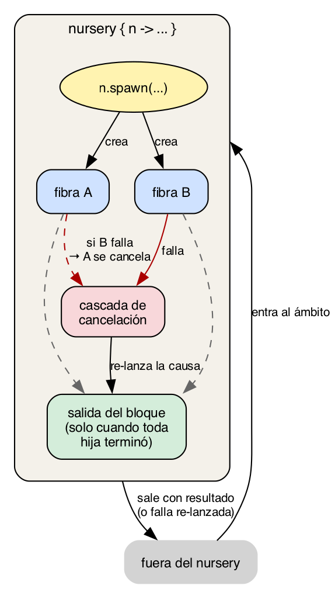

# Capítulo 13 · Concurrencia y memoria

La concurrencia es donde la mayoría de los lenguajes acumulan
deuda. Threads con shared memory llevan a races que aparecen una
vez al mes y se arreglan tres veces; `async`/`await` introduce
colores de funciones; los actores corrigen lo anterior pero
históricamente vienen con GC y un runtime pesado.

kaikai apuesta por una combinación poco usual: **fibras
cooperativas + memoria por fibra + Perceus**. La estructura tiene
tres consecuencias que valen la pena nombrar antes de la
sintaxis:

- **No hay shared memory entre fibras.** Cada fibra tiene su
  propio heap. Lo que una pasa a otra se copia o se mueve.
  Las data races desaparecen por construcción.
- **No hay GC ni borrow checker.** Perceus libera la memoria
  cuando el último uso de cada valor termina, sin un colector
  asincrónico y sin pedirle al programador que anote lifetimes.
  El compilador descubre dónde poner los `free`s analizando el
  programa.
- **La concurrencia es un efecto.** `spawn` es una operación de
  un efecto `Spawn`, no una palabra clave. Crear y esperar
  fibras se compone con el resto del sistema (`State`, `Cancel`,
  un `Fail` que declares tú) usando la maquinaria del cap. 12.

Vamos por partes.

## 13.1 El modelo: fibras aisladas

Una **fibra** es una unidad de ejecución parecida a un thread,
pero mucho más liviana: del orden de cientos de bytes en vez de
megabytes. Una aplicación kaikai puede tener miles o cientos de
miles de fibras vivas sin reventar.

Las fibras son **cooperativas**. Cada una corre hasta que llega a
un **punto de yield**: una llamada que voluntariamente le pasa el
control al scheduler. Los puntos de yield son explícitos:

- `spawn.yield()`: "ya pude correr un rato, prueba otra".
- `spawn.await(f)`: "espera a que termine la fibra `f`".
- Las operaciones de IO que el scheduler intercepta (lecturas de
  red, sleep, etc.).

Sin yield, una fibra corre hasta terminar. Eso es **determinismo
local**: dentro de un bloque sin yields, sabes exactamente qué
pasa. Comparado con threads preemptivas, esto te quita una clase
entera de bugs: no hay carrera sobre datos que toques entre dos
yields porque nadie te va a interrumpir.

A cambio, una fibra que nunca cede el control bloquea a todas las
demás. Es responsabilidad del programador poner yields donde tenga
sentido. En la práctica, las llamadas a IO ya los traen, y el
único caso donde hay que pensar en yields manuales es en bucles
puros de CPU intenso.

### Memoria por fibra

Cada fibra tiene su **propio heap**. Cuando una fibra crea un
record, una lista, un closure, el espacio sale de ese heap. La
otra fibra no puede tocarlo: ni leerlo, ni escribirlo. El sistema
de tipos lo garantiza.

¿Cómo se comunican dos fibras entonces? Pasándose valores.
Cuando una fibra envía un mensaje a otra (vía mailbox de actor o
vía el resultado de un `await`), el valor se copia al heap de la
fibra receptora. Para tipos pequeños esto es trivial; para
estructuras grandes, kaikai usa Perceus para mover en vez de
copiar cuando el emisor ya no va a usar el valor.

Lo importante es la garantía: **no hay manera de que dos fibras
tengan un puntero al mismo objeto**. Las data races, los
problemas de visibility de memoria, los bugs de cache coherence:
todo lo que en threads tradicionales necesita lectura/escritura
con `Atomic` o locks no existe aquí. La concurrencia es por
mensajes, no por memoria compartida.

## 13.2 Perceus en una página

¿Cómo se libera la memoria? Sin GC y sin borrow checker, hay un
tercer enfoque: **reference counting estricto basado en Perceus**
(Lorenz, Leijen, Reinking, 2021).

La idea es que el compilador analiza cada función para descubrir
en qué punto cada valor deja de ser usado. En ese punto inserta
una instrucción que decrementa el contador de referencias del
valor: si llega a cero, se libera; si no, se queda para otro uso.

```kai
fn ejemplo(xs: [Int]) : Int {
  let n = list.length(xs)   # primer uso de xs
  let s = list.sum(xs)       # último uso de xs: aquí se "consume"
  s + n                      # xs ya no existe; n y s sí
}
```

A diferencia de un GC:

- **No hay pausa.** El liberado es síncrono, predecible, parte
  del código generado.
- **No hay overhead asincrónico.** El compilador conoce el
  ciclo de vida exacto de cada valor.
- **No hay hilo aparte.** El scheduler no compite con un
  colector.

A diferencia de un borrow checker:

- **No hay anotaciones de lifetime.** El programador no escribe
  `'a` ni `&` ni `mut`.
- **No hay limitaciones de pattern de uso.** Si necesitas dos
  referencias al mismo valor, el compilador inserta los
  increments y decrements necesarios.

¿El costo? Cuando un valor se usa varias veces, los contadores
se mueven. Para valores muy compartidos esto puede agregar
overhead, y Perceus tiene optimizaciones agresivas para
minimizarlo (reuse in place: si un valor está por liberarse y
se necesita uno del mismo shape inmediatamente después, se
reusa la misma memoria sin tocar el contador). En la práctica
el costo es bajo y predecible.

Para el caso extremo — un cálculo que arma montañas de
estructura descartable solo para plegarla a un escalar —
existe un escape opt-in: el bloque `region`, que asigna en
una arena y la libera entera de un golpe, sin contadores de
por medio. Es parte del mismo catálogo de kinds que las
unidades del capítulo 10, y lo vemos en el capítulo 19.

Por qué esto importa para concurrencia: Perceus funciona por
fibra. Cada fibra tiene sus propios contadores, sus propios
liberados. No hay sincronización entre fibras para ningún
contador: nunca dos fibras se pasan punteros al mismo valor
con contador compartido. Esa es la razón por la que el modelo
"fibras aisladas" cierra cuando se le agrega Perceus: el
mismo invariante que protege contra data races también
simplifica el RC.

## 13.3 Crear y esperar fibras: las operaciones básicas

La forma más simple de usar fibras es con `spawn.spawn` y
`spawn.await`:

```kai
import spawn

fn worker(tag: String, n: Int) : Unit / Stdout + Spawn {
  if n > 0 {
    println(tag)
    spawn.yield()
    worker(tag, n - 1)
  }
}

fn main() {
  let f = spawn.spawn(() => worker("B", 3))
  worker("A", 3)
  spawn.await(f)
}
```

Una salida posible:

```
$ kai run ejemplos/cap13/01_dos_fibras.kai
A
B
A
B
A
B
```

**"Una salida posible" es literal, y conviene detenerse aquí.**
Este programa no promete ese orden. `A` y `B` son fibras
independientes: nada en el código dice que la primera `A` va
antes que la primera `B`. El runtime reparte las fibras entre
tantos hilos del sistema como núcleos tenga tu máquina, así
que en la práctica vas a ver órdenes distintos entre corrida y
corrida — `A A A B B B` es tan válido como el intercalado de
arriba.

Si quieres la salida perfectamente alternada, hay una manera:

```
$ KAI_THREADS=1 kai run ejemplos/cap13/01_dos_fibras.kai
A
B
A
B
A
B
```

`KAI_THREADS=1` fuerza al scheduler a un solo hilo, y ahí sí
`spawn.yield()` es lo único que decide de quién es el turno.
Es el modo con el que vas a querer leer los ejemplos de este
capítulo cuando el punto sea *ver* la alternancia. Volvemos
sobre esto en §13.8; por ahora quédate con la idea de que la
alternancia es una propiedad del scheduler de un hilo, no una
garantía del lenguaje.

Lectura literal:

- `import spawn` trae las operaciones de fibras.
- `spawn.spawn(() => worker("B", 3))` crea una fibra nueva que
  va a correr el lambda cuando el scheduler la elija.
- `worker("A", 3)` corre en la fibra actual (la del `main`).
- `spawn.yield()` dentro de `worker` cede el control: la fibra
  declara un punto donde puede perder el turno.
- `spawn.await(f)` espera a que `f` termine antes de que `main`
  retorne.

`Spawn` aparece en la firma de `worker` porque la función llama
a `spawn.yield()`, que es una operación de `Spawn`. La fila
contagia hacia arriba como con cualquier efecto del cap. 12.

### Por qué los yields son explícitos

En lenguajes con threads preemptivas (Java, Go, Rust con
`std::thread`), el scheduler puede interrumpir un thread en
cualquier instrucción. Eso obliga a programar como si cualquier
línea pudiera ser interrumpida por otra fibra modificando
datos compartidos.

En kaikai, **una fibra sigue corriendo hasta que llega a un
punto de yield**. Entre yields, tienes determinismo local: si
modificas un valor local, nadie más lo va a tocar hasta que tú
cedas el control. Esto reduce mucho la carga cognitiva.

A cambio, tienes que **acordarte de poner los yields**. La regla
mental es: si tu función tiene un bucle largo de puro cómputo,
agrega un `spawn.yield()` cada cierto número de iteraciones.
Las funciones de IO ya yieldan por dentro.

## 13.4 Nurseries: concurrencia estructurada

`spawn.spawn` + `spawn.await` funciona, pero tiene un problema:
si te olvidas del `await`, la fibra se queda viva más allá del
scope donde la creaste. Y si esa fibra falla, te enteras tarde
o no te enteras.

Las **nurseries** atan las fibras a un scope léxico. Una fibra
solo puede vivir dentro de un nursery, y el nursery espera a
todas sus hijas antes de salir.

```kai
import spawn

fn worker(tag: String, n: Int) : Unit / Stdout + Spawn {
  if n > 0 {
    println(tag)
    spawn.yield()
    worker(tag, n - 1)
  }
}

fn main() : Unit / Stdout + Spawn + Cancel {
  let _ = nursery { n ->
    n.spawn(() => worker("A", 3))
    n.spawn(() => worker("B", 3))
  }
}
```

El `let _` envuelve al `nursery` entero: el bloque devuelve el
valor de su última expresión (aquí un `Fiber[Unit]` que no nos
sirve), y `let _` lo descarta. No es lo que hace que las fibras
se esperen, de eso se encarga el nursery solo; solo tira un
valor que no usamos.

`nursery { n -> ... }` abre un scope. Adentro, `n` es la
capacidad para crear fibras:

- `n.spawn(f)` crea una fibra hija. Devuelve un `Fiber[T]`
  donde `T` es el tipo que `f` devuelve. Aquí ni lo atamos: no
  necesitamos el valor, y el nursery espera a las fibras de
  todos modos.
- `n.await(f)` espera a esa fibra y devuelve su valor. Solo lo
  necesitas cuando quieres el resultado; para esperar a secas
  no hace falta.
- `n.select([a, b, ...])` espera a que cualquiera termine y
  cancela las demás.
- `n.cancel(f)` cancela una fibra específica.
- `n.cancel_all()` cancela todas las hijas.

Lo que el nursery garantiza:

- **Al salir del bloque, todas las hijas terminaron.** El
  nursery hace *join* automático de cada hija al cerrar la
  llave, sin que tengas que pedir un `await`. No hay fugas: una
  fibra no sobrevive al `nursery` que la creó.
- **Si una hija falla por su cuenta, las demás se cancelan.**
  Cuando una hija lanza `Cancel` sin que nadie se lo haya
  pedido (un crash), el nursery cancela a las hermanas que
  siguen vivas y re-lanza la causa fuera del scope. En cambio,
  una hija que cancelas a pedido con `n.cancel` termina como
  resultado esperado y no contagia a las demás.
- **Si el nursery se cancela desde afuera, propaga la
  cancelación a todas sus hijas.**



Figura 13.1 · *Concurrencia estructurada en una imagen. El
nursery es un ámbito léxico; las fibras hijas viven adentro;
nada se escapa. Si una hija falla, el nursery cancela al
resto antes de re-lanzar; si al padre lo cancelan desde
afuera, la cascada baja.*

Esto se llama **concurrencia estructurada**. La idea es de
Nathaniel Smith en su ensayo *"Notes on structured concurrency,
or: Go statement considered harmful"* (2018), y aparece también
en Trio, Kotlin coroutines, Swift y OCaml 5 Eio. La forma de
kaikai integra el patrón en el sistema de efectos: la capacidad
`Spawn` solo está disponible dentro de un nursery, y eso es lo
que el sistema de tipos exige.

### Por qué `Cancel` aparece en la firma de `main`

Fíjate que `main` declara `/ Stdout + Spawn + Cancel`. ¿Por qué
`Cancel`? Porque cada `spawn`, `await` y `select` es un punto
de yield, y todo punto de yield puede recibir una
`Cancel.raise()` desde el scheduler (si alguien cancela el
nursery desde afuera, o si una fibra hermana falla). Toda
función que use `Spawn` carga implícitamente `Cancel`.

### `nursery` es azúcar sobre un `handle`

`nursery { n -> ... }` parece una palabra clave del lenguaje,
pero no lo es. Las fibras son **un efecto** llamado `Spawn`,
con esta declaración en el stdlib:

```kai
effect Spawn {
  spawn[T, e](f: () -> T / e) : Fiber[T]
  await[T](f: Fiber[T])       : T
  select[T](fs: [Fiber[T]])   : T
  yield()                     : Unit
  cancel[T](f: Fiber[T])      : Unit
}
```

Es un efecto ordinario, declarado igual que `Log` o `State[T]`
del cap. 12. Y `nursery { n -> body }` se reescribe en tiempo
de compilación a `handle { body } with Spawn as n { ... }`,
con un handler interno que gestiona el árbol de fibras hijas,
espera a las pendientes al salir y propaga fallos.

Eso significa que el lenguaje core **no tiene primitivas de
concurrencia**: tiene efectos. Las fibras, los nurseries, la
cancelación son una biblioteca construida sobre dos efectos
del stdlib (`Spawn` y `Cancel`). El cap. 14 va a hacer lo
mismo para los actores (efecto `Actor[Msg]`), y el patrón se
repite: lo distintivo de kaikai no es la lista de
construcciones, sino que **todas son la misma construcción**
(efectos algebraicos) con nombres distintos.

## 13.5 Cancelación cooperativa

La cancelación en kaikai es **cooperativa**: el scheduler no
mata a una fibra de golpe. Le entrega una `Cancel.raise()` en
el próximo punto de yield. La fibra puede:

- **Desenrollarse limpiamente.** Si no maneja `Cancel`, el
  unwinding la saca de cualquier `handle`, `nursery`, etc., y
  los handlers de cancelación por encima toman el control.
- **Manejar `Cancel` para hacer cleanup.** La fibra instala un
  handler de `Cancel` que corre el cleanup (cerrar archivos,
  soltar conexiones) y NO llama a `resume`, dejando que el
  unwinding continúe.

```kai
fn trabajador_largo(tag: String) : Unit / Stdout + Spawn + Cancel {
  handle {
    contar(tag, 0)
  } with Cancel {
    raise(resume) -> {
      println("#{tag}: cancelado, hago cleanup")
      # no llamamos a resume: la fibra se desenrolla
    }
  }
}

fn contar(tag: String, n: Int) : Unit / Stdout + Spawn + Cancel {
  println("#{tag}: #{n}")
  spawn.yield()
  contar(tag, n + 1)
}
```

`trabajador_largo` cuenta indefinidamente. Si el nursery la
cancela, el handler de `Cancel` imprime el mensaje y la fibra
sale, sin quedarse colgada ni abortar el proceso.

La clave conceptual: `Cancel.raise()` es la **operación**, y
`handle ... with Cancel { ... }` es el handler. Mismo patrón
del cap. 12: la cancelación es un efecto más, con un handler
escrito por el usuario o instalado por el runtime.

### `Spawn.cancel(f)` y los handlers de `Cancel`

Vale distinguir dos nombres parecidos:

- **El efecto `Cancel`** es lo que la fibra **recibe** cuando
  la cancelación le llega. Su única op `raise()` la inyecta
  el scheduler en el próximo punto de yield.
- **`Spawn.cancel(f)`** es lo que una fibra **llama** para
  pedirle al scheduler que entregue `Cancel.raise()` a la
  fibra `f`.

Cuando llamas `n.spawn(...)` con un binding `n` y obtienes una
fibra hija, `Spawn.cancel(hija)` no la mata: agenda la entrega.
La hija, en su próximo yield, recibe `Cancel.raise()` y su
propio handler de `Cancel` corre: exactamente el que la fibra
hija instaló con `with Cancel { ... }`. Si no instaló ninguno,
la fibra se desenrolla limpiamente y los handlers más arriba
en la pila (típicamente del nursery) toman el control.

La única excepción es el **trap-exit** del modelo de actores
(cap. 14): una fibra puede marcarse para que los crashes de
sus pares se conviertan en mensajes en su mailbox en vez de
gatillar cancelación, pero esa es una opción explícita y
local; el default sigue siendo la cancelación cooperativa
descrita aquí.

## 13.6 Memoria mutable por fibra

El cap. 12 §12.7 cubrió `var` (celdas locales, azúcar sobre
`State[T]`) y el efecto `Mutable` (que rige a `Ref[T]` y
`Array[T]` cuando la mutación es observable). Toda esa
maquinaria funciona igual que en código secuencial, con una
sola adición que viene del modelo de fibras: **la memoria
mutable vive en el heap de la fibra que la creó**.

Cuando una fibra crea un `Array[T]` o un `Ref[T]`, el espacio
sale de su propio heap. Otra fibra no tiene cómo acceder a esa
memoria: no hay punteros compartidos, no hay paso por
referencia entre fibras. Si una fibra quiere darle un valor
mutable a otra, lo manda por mailbox (cap. 14) y el runtime
mueve el contenido al heap del receptor.

Esta es la pieza que hace que la mutación no introduzca data
races en kaikai. En un lenguaje con threads y memoria
compartida, un `Array[T]` mutable necesita locks o atomics
para ser tocado desde varios hilos. En kaikai, el sistema de
tipos garantiza que ningún `Array[T]` está siendo modificado
por dos fibras al mismo tiempo, porque ningún `Array[T]` es
accesible desde dos fibras al mismo tiempo. La aislación de
memoria del §13.1 cubre también las celdas mutables.

## 13.7 Por qué las fibras no pueden escapar de su nursery

Un detalle del sistema de tipos: **`Fiber[T]` no es un valor
movible**. No puedes devolverlo de una función, no puedes
guardarlo en un `Option` o un record, no puedes pasarlo a otra
fibra.

```kai
fn no_compila() : Fiber[Int] {       # ERROR
  nursery { n ->
    n.spawn(() => 42)                 # no se puede devolver
  }
}
```

¿Por qué? Porque una fibra solo tiene sentido dentro del
nursery que la creó. Si se permitiera devolverla, ¿quién la
esperaría? ¿Quién la cancelaría si el nursery termina? La
estructura se rompe.

Una lista de fibras dentro del mismo nursery es legal:

```kai
nursery { n ->
  let fibers = [1, 2, 3] | (x) => n.spawn(() => procesar(x))
  fibers | (f) => n.await(f)
}
```

Pero esa lista vive dentro del nursery. No puede salir.

Esto cierra el modelo: cada fibra tiene un padre conocido, cada
fibra termina antes de que su padre termine, y el sistema de
tipos lo garantiza al nivel sintáctico, no al nivel de
convención. **No hay manera de que una fibra se quede
huérfana.**

## 13.8 Caso de estudio: repartir trabajo entre fibras

Cerramos con un patrón que vas a escribir muchas veces:
repartir una lista de tareas entre varias fibras trabajadoras
y juntar los resultados al final.

Antes del código, una restricción que conviene tener clara,
porque decide la forma de la solución: **los handlers de
efectos son locales a la fibra**. Si instalas un handler de
`State` en el `main` y una fibra hija ejecuta `State.get()`,
esa operación no encuentra handler y el programa aborta:

```
kai: effect not handled in fiber: State
```

No es un descuido del runtime, es el mismo invariante de
aislación que sostiene todo el capítulo. Una capacidad es
parte del contexto de una fibra, y una fibra no hereda el
contexto de quien la creó. Lo único que cruza un `spawn` en
una dirección son los valores que capturas en el lambda, y en
la otra el valor de retorno que recoge `await`.

Así que la "cola compartida" que uno escribiría en Go con un
canal, o en Java con un `BlockingQueue`, aquí no se escribe
así. Se reparte el trabajo por adelantado y cada fibra devuelve
lo suyo:

```kai
import spawn
import core.list

fn procesar_lote(id: Int, lote: [String]) : [String] / Spawn =
  match lote {
    []           -> []
    [t, ...rest] -> {
      spawn.yield()
      ["worker #{id}: #{t}", ...procesar_lote(id, rest)]
    }
  }
```

`procesar_lote` no sabe que existen otras fibras. Recibe su
lote, lo recorre, y va armando la lista de salida. El
`spawn.yield()` está para que las trabajadoras se turnen; no
cambia el resultado, solo lo hace concurrente de verdad.

El `main` reparte, espera y concatena:

```kai
fn main() : Unit / Stdout + Spawn + Cancel {
  let resultados = nursery { n ->
    let a = n.spawn(() => procesar_lote(1, ["alpha", "bravo"]))
    let b = n.spawn(() => procesar_lote(2, ["charlie", "delta"]))
    let c = n.spawn(() => procesar_lote(3, ["echo", "foxtrot"]))
    n.await(a) ++ n.await(b) ++ n.await(c)
  }
  imprimir(resultados)
  println("(#{list.length(resultados)} tareas procesadas)")
}
```

(`imprimir` es un recorrido trivial de la lista; está completo
en el archivo del ejemplo.)

Salida:

```
$ kai run ejemplos/cap13/06_reparto_de_lotes.kai
worker 1: alpha
worker 1: bravo
worker 2: charlie
worker 2: delta
worker 3: echo
worker 3: foxtrot
(6 tareas procesadas)
```

Y esta vez la salida **sí** está garantizada, a diferencia de
los ejemplos anteriores del capítulo. No porque las fibras
corran en orden — corren como quieran, en los núcleos que
haya — sino porque nadie imprime desde una fibra. Las
trabajadoras solo devuelven listas; el `main` las concatena en
el orden que él eligió al escribir `n.await(a) ++ n.await(b) ++
n.await(c)`, y recién ahí imprime. El orden de la salida es una
consecuencia del código, no del scheduler.

Esa es una regla de diseño que vale más que el ejemplo: **si
te importa el orden, ordénalo tú en el punto de reunión, no
confíes en el de ejecución.**

¿Y si el trabajo no se puede repartir por adelantado — si las
tareas llegan de a poco, o son de duración muy dispareja y
quieres que la fibra que se desocupa tome la siguiente? Ahí sí
necesitas algo que posea la cola y responda pedidos. Ese algo
es un actor, y es el capítulo 14.

### Concurrencia y paralelismo

Vale ser preciso con dos palabras que se confunden seguido.

**Concurrencia** es una propiedad de tu programa: tener varias
líneas de trabajo vivas a la vez, que progresan de manera
independiente. **Paralelismo** es una propiedad de la máquina:
que dos de esas líneas ejecuten instrucciones en el mismo
instante, en núcleos distintos.

kaikai te da las dos. Las fibras son el mecanismo de
concurrencia: livianas, cooperativas, atadas a un nursery. Y
desde la versión 0.104 el runtime las reparte por defecto
sobre tantos hilos del sistema como núcleos tenga la máquina,
con un scheduler M:N que roba trabajo entre hilos. No hay que
pedirlo ni configurar nada: el programa que escribiste en
§13.3 ya usa tus dieciséis núcleos si los tienes.

Lo que **no** cambia con el número de hilos es la semántica:

- Cada fibra sigue teniendo su propia memoria. Un mensaje que
  cruza de un hilo a otro se copia, así que el conteo de
  referencias de Perceus sigue sin necesitar atómicos.
- Las fibras siguen siendo cooperativas: ninguna es
  interrumpida a media instrucción. Entre dos yields, una
  fibra tiene determinismo local.
- Nurseries, cancelación y `await` se comportan igual con uno
  o con treinta y dos hilos.

Lo que sí cambia es lo que ya viste: **el orden en que se
intercalan fibras independientes deja de ser predecible**. Con
un hilo, `spawn.yield()` decidía los turnos y la salida era
reproducible. Con varios, no. Por eso `KAI_THREADS=1` sigue
existiendo: fuerza el scheduler cooperativo de un solo hilo,
byte a byte idéntico al de antes. Es la herramienta para
depurar una carrera, para un test que compara salida literal,
o para leer un ejemplo pedagógico como los de este capítulo.

```sh
$ ./programa                  # tantos hilos como núcleos
$ KAI_THREADS=4 ./programa    # cuatro, ni más ni menos
$ KAI_THREADS=1 ./programa    # cooperativo, reproducible
```

Ahora sí, la pregunta útil: **¿te va a servir?** Si tu programa
está limitado por IO — esperar red, leer archivos, recibir
mensajes — las fibras ya te pagaban antes, porque mientras una
espera bytes las otras corren. Si está limitado por CPU, antes
las fibras te daban estructura pero no velocidad; hoy sí te
dan velocidad, siempre que el trabajo se pueda partir en
pedazos que no dependan uno del otro. El ejemplo de esta
sección es exactamente esa forma.

## 13.9 Filosofía: dos invariantes que vale recordar

Si quieres recordar dos cosas del capítulo, que sean estas:

1. **Cada fibra tiene su propio heap.** No hay shared memory
   entre fibras. La comunicación es por mensajes (mailbox de
   actor, resultado de `await`). Las data races no existen por
   construcción, no por disciplina.

2. **Cada fibra tiene una vida atada a un scope léxico.** No
   puede escapar del `nursery` que la creó; el sistema de
   tipos rechaza cualquier intento. Si el padre termina, todas
   las hijas terminaron. Si una hija falla, las hermanas se
   cancelan.

Estos dos invariantes se sostienen mutuamente. La aislación de
memoria es lo que permite que Perceus funcione por fibra sin
sincronización. La estructura léxica es lo que permite
liberar la memoria predeciblemente al final del scope.
Cualquier modelo que rompa uno de los dos rompe el otro.

A cambio, hay clases enteras de bugs que no tienes que pensar:

- No hay `volatile` ni `Atomic` ni memory ordering.
- No hay `lock` ni `mutex` ni `RwLock`.
- No hay borrow checker, ni `'a` lifetimes, ni `Rc<RefCell<T>>`.
- No hay `async fn` ni `Future` ni colores de funciones.
- No hay GC pause-the-world.

Es un trade-off: pierdes la libertad de tener punteros
arbitrarios entre fibras. Pero la ganancia (en seguridad, en
predictibilidad, en simplicidad mental) es lo que justifica
el modelo.

## Ejercicios

**13.1.** Modifica el ejemplo §13.3 (dos fibras cooperativas)
para que `worker("A")` haga 5 iteraciones y `worker("B")` haga
2. ¿Cómo cambia la salida? ¿Qué pasa si quitas los
`spawn.yield()` de uno solo de los dos workers?

**13.2.** Una fibra crea un `Array[Int]` localmente y lo
modifica con `a[i] := v`. Después termina sin pasarlo a nadie.
¿Por qué este programa no introduce data races aunque otra fibra
esté corriendo concurrentemente? Da el argumento en dos líneas,
en términos del modelo de memoria por fibra de §13.1.

**13.3.** Implementa una función `with_timeout[T](ms: Int, f: ()
-> T / Spawn) : Option[T] / Spawn + Cancel + Time`. Usa
`n.select` para correr `f` contra una fibra que hace
`Time.sleep(ms)` y devuelve `None`. Pista: necesitas un tipo
suma local para distinguir "completó" de "timeout".

**13.4.** El §13.8 reparte los lotes de antemano y en partes
iguales. Modifícalo para que los lotes tengan tamaños muy
dispares (uno con diez tareas, dos con una) y mide cuánto
tarda el conjunto. Después reparte las once tareas en tres
lotes parejos y vuelve a medir. ¿Por qué el reparto estático
deja núcleos ociosos, y qué necesitarías para evitarlo?

**13.5.** Una fibra que entra a un bucle infinito sin
`spawn.yield()` no cede su turno. Escribe ese código y observa
qué pasa: primero con `KAI_THREADS=1`, después sin la
variable. ¿Por qué el síntoma cambia? Agrega yields cada N
iteraciones. ¿Cada cuántas? ¿Cómo decides el N?

**13.6.** En tu lenguaje habitual, busca un programa
concurrente que escribiste o que mantienes. Cuenta cuántas
líneas son "trabajo real" (la lógica del programa) versus
cuántas son "concurrencia plumbing" (mutex, queues, atomics,
async/await, callbacks). Estima qué porcentaje del código
quedaría con el modelo de kaikai.
