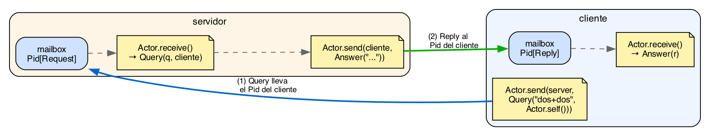

# Capítulo 14 · Actores

El capítulo 13 mostró cómo arrancar fibras y coordinarlas vía
un nursery. Eso resuelve la concurrencia interna: muchas
unidades de trabajo dentro de un mismo programa, repartidas
sobre los núcleos de la máquina.

Para muchos casos esa estructura alcanza. Pero hay un patrón
que las fibras puras dejan incómodo, y vale la pena nombrarlo
antes de la sintaxis.

## Una fibra es un cómputo; un actor es un proceso vivo

Imagina dos tareas distintas:

- **Tarea A:** parsea un archivo grande y devuelve la lista de
  errores que encontró. Arranca, trabaja, termina, devuelve un
  valor.
- **Tarea B:** mantén una cache en memoria que responde
  consultas (`get(key)` y `put(key, value)`). Arranca, queda
  viva, responde mensajes mientras el programa exista, en
  algún momento termina cuando alguien le pide que se detenga.

Las dos son concurrentes en el sentido de que el programa
principal puede seguir trabajando mientras pasan. Pero su
forma es muy distinta.

La tarea A es un **cómputo**: tiene una entrada, produce un
valor de salida, termina. Eso es una **fibra**. La creas con
`spawn`, esperas su resultado con `await`, recibes el valor.
Una vez devuelto el resultado, la fibra deja de existir.

```kai
let f = spawn.spawn(() => parsear_archivo("entrada.txt"))
# ... otro trabajo concurrente ...
let errores = spawn.await(f)   # un solo valor, y se acabó
```

La tarea B es un **proceso vivo**: no tiene un único valor de
retorno, tiene una secuencia interminable de interacciones.
Para esto kaikai trae el modelo de **actores**, heredado en
espíritu de Erlang y BEAM.

```kai
let cache = spawn_actor(() => bucle_cache())
Actor.send(cache, Put("usuario:42", "ada"))
Actor.send(cache, Put("usuario:43", "turing"))
match Actor.receive() {
  Found(v) -> ...
  Missing  -> ...
}
```

Un actor es **una fibra con un mailbox tipado encima**. La
fibra es el sustrato (un hilo cooperativo de ejecución); el
mailbox es lo que la hace un actor (un canal donde se acumulan
mensajes para que la fibra los procese en orden).

Comparación lado a lado:

| Aspecto | Fibra | Actor |
|---|---|---|
| ¿Qué es? | Unidad de ejecución | Fibra con mailbox tipado |
| Comunicación | Un valor de retorno vía `await` | Mensajes vía `send`/`receive` |
| Ciclo de vida | Arranca, calcula, devuelve, muere | Arranca, queda en bucle procesando, muere cuando decide |
| Cómo se crea | `spawn.spawn` o `n.spawn` | `spawn_actor` |
| Cómo le hablas | `await` para obtener su `T` | `send` cualquier cantidad de veces |
| Cuándo elegirlo | Cálculo discreto concurrente | Servicio de larga vida, estado interno, consultas |

La regla mental:

- **¿La tarea termina con un valor que el padre necesita?** Fibra.
- **¿La tarea vive y responde mensajes a varios clientes?**
  Actor.

Ambos modelos son **concurrentes y paralelos**: el runtime
reparte fibras y actores sobre tantos hilos del sistema como
núcleos tenga la máquina (cap. 13 §13.8 *Concurrencia y
paralelismo*). Que un actor corra en otro hilo no cambia nada
de lo que vas a leer en este capítulo: su mailbox se sigue
procesando en serie, un mensaje a la vez, y los mensajes que
cruzan de un hilo a otro se copian. Ningún actor observa
memoria compartida, corras con uno o con treinta y dos hilos.

Casos donde el actor es lo natural: un servidor de cache, un
controlador de conexiones, un supervisor de procesos, un router
de notificaciones, una cola de tareas, un actor logger. Casos
donde la fibra basta: un cómputo que el padre quiere hacer en
paralelo conceptual mientras hace otra cosa, un `with_timeout`
que mide cuánto tarda algo, un map concurrente sobre una lista
de IO.

De todo lo que hay en kaikai, esta es la parte que menos me
pertenece. El reparto entre cómputo y proceso vivo lo resolvió
Erlang hace décadas, y lo tomé casi sin cambios.

## Los actores no son primitivos del lenguaje

Otra cosa que vale fijar antes de la sintaxis: en kaikai, los
actores no son una construcción del core. Son una **capa
construida con efectos algebraicos**: el efecto `Actor[Msg]`
declara las operaciones (`self`, `send`, `receive`); el
stdlib provee funciones como `with_mailbox` y `spawn_actor`
que instalan el handler de `Actor[Msg]` sobre una fibra
ordinaria.

Es el mismo principio que con `nursery` del cap. 13: el
lenguaje core tiene solo efectos; los patrones de uso
(fibras, actores, supervisión) aparecen en bibliotecas que
cualquier lector puede leer. Si después de este capítulo te
preguntas cómo funciona `spawn_actor` por dentro, la respuesta
es un `spawn.spawn` más un `handle ... with Actor[Msg]`.

## 14.1 `Actor[Msg]`: el efecto

Un actor es una fibra dentro de un `handle ... with
Actor[Msg]` que le da acceso a tres operaciones. El efecto
viene declarado en el stdlib:

```kai
# Declarado en stdlib/actor.kai, accesible vía `import actor`.
pub effect Actor[Msg] {
  self()                         : Pid[Msg]
  send(pid: Pid[Msg], msg: Msg)  : Unit / Cancel
  receive()                      : Msg / Cancel
}
```

- **`self()`** devuelve el `Pid` del actor actual. El `Pid` es
  el handle con el que otros le mandan mensajes.
- **`send(pid, msg)`** encola `msg` en el mailbox de `pid`. Si
  el mailbox está lleno, el comportamiento depende de la
  policy (lo veremos en §14.4).
- **`receive()`** saca el siguiente mensaje del mailbox del
  actor actual. Si no hay nada, la fibra se suspende hasta que
  llegue uno. Como suspende, es un punto de yield y carga
  `Cancel`.

`Msg` es el tipo concreto de los mensajes que ese actor recibe.
**Un actor maneja un solo tipo de mensaje.** Si necesitas mezclar
shapes, los unificas con un sum type:

```kai
type ServerMsg
  = Ping(Pid[Pong])
  | Stop
  | Tick
```

El actor sabe que solo va a recibir uno de esos tres
constructores, y el `match` exhaustivo en `receive()` te
garantiza que cubres todos los casos.

### `Pid[Msg]`: handle tipado

Un `Pid[Msg]` es un identificador de mailbox. Tiene tipo, así
que el compilador no te deja mandarle a un `Pid[Tarea]` un
mensaje de tipo `Notificación`. Esta es la diferencia más
fuerte con Erlang: en Erlang los PIDs son no tipados; en
kaikai son específicos al tipo de mensaje.

Como `Fiber[T]` del cap. 13, `Pid[Msg]` está **atado al scope
que lo creó**. No puedes guardarlo en un record que sobreviva
al nursery, devolverlo de una función fuera de la familia
estándar, ni pasarlo entre estructuras de datos no aprobadas.
El compilador lo rechaza. Esto cierra el modelo: cada PID
tiene un padre conocido, y muere con él.

## 14.2 `with_mailbox`: dar mailbox a la fibra actual

La forma más simple de empezar es darle mailbox a la fibra
en la que ya estás. `with_mailbox` instala el handler de
`Actor[Msg]` y entrega el control a su body:

```kai
import actor

fn main() : Unit / Console {
  with_mailbox {
    Actor.send(Actor.self(), "hola")
    Actor.send(Actor.self(), "mundo")
    Stdout.print(Actor.receive())
    Stdout.print(Actor.receive())
  }
}
```

Salida:

```
$ kai run ejemplos/cap14/01_with_mailbox.kai
hola
mundo
```

`with_mailbox { ... }` es una llamada con sintaxis de trailing
lambda: el bloque entre llaves es el cuerpo que se ejecuta con
el mailbox instalado. Como `with_mailbox` no le pasa argumentos
al body (es una lambda de cero parámetros), el bloque no lleva
flecha ni binder. Adentro, `Actor` es la capacidad disponible:
`Actor.self()` devuelve el `Pid` del mailbox recién creado,
`Actor.send(pid, msg)` encola, `Actor.receive()` saca el
siguiente.

En este ejemplo el actor se manda a sí mismo. Es la versión
"hola mundo" del modelo; el ejercicio real es comunicar dos
actores distintos.

## 14.3 `spawn_actor`: crear un actor nuevo

Para arrancar un actor que corre en su propia fibra:

```kai
import actor

fn trabajador() : Unit / Actor[String] + Console {
  let t1 = Actor.receive()
  Stdout.print("trabajando: " ++ t1)
  let t2 = Actor.receive()
  Stdout.print("trabajando: " ++ t2)
  let t3 = Actor.receive()
  Stdout.print("trabajando: " ++ t3)
}

fn main() : Unit / Console + Spawn + Cancel + Actor[String] {
  with_mailbox {
    let pid = spawn_actor(() => trabajador())
    Actor.send(pid, "tarea-1")
    Actor.send(pid, "tarea-2")
    Actor.send(pid, "tarea-3")
    spawn.yield()
    spawn.yield()
    spawn.yield()
    spawn.yield()
  }
}
```

`spawn_actor` arranca una fibra nueva, le instala un mailbox,
y devuelve el `Pid` para que el padre pueda mandarle mensajes.
La firma del trabajador declara `Actor[String]`: necesita el
efecto para llamar a `Actor.receive()`.

Fíjate que `main` también tiene `Actor[String]` en su fila.
¿Por qué? Porque `Actor.send(pid, "tarea-1")` es una
invocación a una operación del efecto `Actor[String]`, y como
toda invocación a un efecto, requiere que el efecto esté
disponible en el contexto. El `with_mailbox` de `main` provee
esa capacidad. El `pid` ya identifica al mailbox destino;
el handler solo dispatcha la operación.

Los `spawn.yield()` al final son para darle al scheduler la
chance de correr al trabajador. Sin ellos, `main` saldría antes
de que el trabajador procesara nada.

### `receive_timeout`: recibir con plazo

`Actor.receive()` bloquea: si el mailbox está vacío, la fibra se
suspende hasta que llegue un mensaje, sin importar cuánto tarde.
Eso es lo que quieres casi siempre, pero a veces esperar para
siempre es exactamente lo que no quieres. Un supervisor que hace
un health check no debería colgarse si el worker dejó de
responder; un cliente que pide algo por la red quiere reintentar
si nadie contesta en 50 ms.

Para eso está `receive_timeout(d)`, que recibe del mailbox
rindiéndose tras una `Duration` y devuelve un `Option`:

```kai
import actor
import time

fn main() : Unit / Console + Spawn + Cancel + Clock + Actor[String] {
  with_mailbox {
    match receive_timeout(time.millis(10)) {
      Some(m) -> Stdout.print("recibido: " ++ m)
      None    -> Stdout.print("timeout: nadie respondió")
    }
  }
}
```

Salida:

```
$ kai run ejemplos/cap14/06_receive_timeout.kai
timeout: nadie respondió
recibido: pong
```

`Some(msg)` si llegó un mensaje antes del deadline, `None` si el
plazo expiró primero. El `Duration` se construye con los
constructores de `time` (`time.millis`, `time.seconds`,
`time.minutes`); como el plazo se mide contra el reloj, la firma
gana el efecto `Clock`. La obligación de hacer `match` sobre el
`Option` es la gracia: el compilador no te deja olvidar el caso
en que el tiempo se acabó.

Para el repertorio completo del módulo (`spawn_actor_policy`,
los wrappers tipados, la op cruda en nanosegundos sobre la que se
construye `receive_timeout`), corre `kai doc actor`.

## 14.4 Policies de mailbox: qué pasa cuando se llena

Por defecto, `with_mailbox` y `spawn_actor` crean un mailbox
**unbounded**: nunca se llena, los mensajes se acumulan
mientras no se lean. Es razonable para empezar, pero
peligroso: si un productor manda más rápido de lo que un
consumidor procesa, la memoria crece sin tope.

Para casos reales, eliges una policy. El stdlib (módulo
`actor`) las expone como dos sum types:

```kai
# Definidos en stdlib/actor.kai, accesibles vía `import actor`.
pub type MailboxPolicy = Unbounded | Bounded(Int, Overflow)
pub type Overflow      = DropOldest | DropNewest | BlockSender
```

`Bounded(capacity, on_full)` da un mailbox de tamaño fijo. El
parámetro `on_full` decide qué hacer cuando llega un mensaje y
ya no hay espacio:

- **`DropOldest`**: el mensaje más viejo se evicciona, el nuevo
  entra. Útil para snapshots: solo importa el estado más
  reciente (telemetría, tick events, GPS).
- **`DropNewest`**: el nuevo se rechaza, el mailbox queda como
  estaba. Útil para "el primero gana" (elección de líder,
  adquisición de lock).
- **`BlockSender`**: el emisor se suspende hasta que se libere
  espacio. Útil para **backpressure**: el productor frena
  cuando el consumidor no da abasto. Es punto de yield, así
  que un sender bloqueado puede recibir `Cancel.raise()`.

```kai
import actor

fn main() : Unit / Console {
  with_mailbox_policy(Bounded(2, DropOldest)) {
    Actor.send(Actor.self(), "a")
    Actor.send(Actor.self(), "b")
    Actor.send(Actor.self(), "c")
    Stdout.print(Actor.receive())
    Stdout.print(Actor.receive())
  }
}
```

Salida:

```
$ kai run ejemplos/cap14/04_mailbox_policy.kai
b
c
```

El mailbox tiene capacidad 2. Mandamos `a`, `b`, `c` sin leer
nada. Cuando llega `c`, no hay espacio, y `DropOldest`
saca `a`. Las dos lecturas recuperan `b` y `c`.

`DropOldest` y `DropNewest` **no notifican al emisor** que su
mensaje se descartó. Si necesitas saberlo, usa `BlockSender` (o
diseña el protocolo con un acuse de recibo). El silencio es
deliberado: la policy expresa una preferencia global del
mailbox, no una negociación por mensaje.

## 14.5 Patrón request/reply

El patrón más común entre actores es pedirle algo a uno y
esperar respuesta. Cada lado del diálogo tiene su propio tipo
de mensaje: el cliente manda un `Request` y recibe un `Reply`;
el servidor recibe `Request` y manda `Reply`. El `Request`
incluye el `Pid[Reply]` del cliente para que el servidor sepa
dónde responder.

```kai
import actor

type Request = Query(String, Pid[Reply])
type Reply   = Answer(String)

fn servidor() : Unit / Actor[Request] + Actor[Reply] + Console {
  match Actor.receive() {
    Query(p, cliente) -> {
      Stdout.print("servidor: recibí '#{p}'")
      Actor.send(cliente, Answer("respuesta a '#{p}'"))
      servidor()
    }
  }
}

fn main() : Unit / Console + Spawn + Cancel + Actor[Reply] {
  with_mailbox {
    let server = spawn_actor(() => servidor())

    Actor.send(server, Query("dos+dos", Actor.self()))
    match Actor.receive() {
      Answer(r) -> Stdout.print("cliente: " ++ r)
    }
  }
}
```



Figura 14.1 · *Request/reply entre dos actores. El cliente
tiene un mailbox `Pid[Reply]`; el servidor tiene un mailbox
`Pid[Request]`. La flecha (1) lleva la `Query`, que incluye
el PID del cliente, hasta el mailbox del servidor; la
flecha (2) devuelve el `Answer` al mailbox del cliente. Dos
mailboxes tipados, dos mensajes, una ida y vuelta.*

Lo importante de la estructura:

- **Dos tipos distintos, `Request` y `Reply`**, cada uno con
  su propio mailbox. El servidor declara `Actor[Request] +
  Actor[Reply]` en su fila: recibe `Request` desde su propio
  mailbox y envía `Reply` al mailbox del cliente. El cliente
  declara solo `Actor[Reply]`: él tiene mailbox de `Reply`, no
  de `Request`. Los tipos te dicen exactamente qué mailbox es
  qué.
- **`Query` incluye el `Pid[Reply]` de retorno.** Sin eso, el
  servidor no sabe a quién contestarle. El tipo del `Pid`
  garantiza que solo se le pueden enviar mensajes de tipo
  `Reply`.
- **El servidor recursa** después de procesar el mensaje. Sin
  esa recursión, el servidor procesaría un solo mensaje y
  terminaría. La recursión por cola se compila a un loop (cap.
  6), así que el actor puede correr indefinidamente sin
  reventar el stack.

Esto reemplaza, en términos prácticos, las llamadas
sincrónicas a una API: pides algo, esperas respuesta, sigues.
La diferencia es que aquí el "servidor" puede estar
atendiendo a varios clientes a la vez, su estado interno está
encapsulado, y el modelo de tipos te garantiza que ningún
cliente se queda esperando una respuesta del tipo equivocado.

## 14.6 Supervisión: links y monitores

En BEAM, los actores se supervisan con **links** (bidireccional)
y **monitores** (unidireccional). Cuando un actor cae, los
actores que lo observan se enteran y deciden qué hacer.

kaikai trae el mismo modelo, expresado como dos efectos que
viven en `stdlib/effects/concurrent.kai`, junto a `Spawn` y
`Actor[Msg]`:

```kai
pub effect Link {
  link(peer: Pid[Nothing]) : Unit
}

pub effect Monitor {
  monitor(target: Pid[Nothing]) : Pid[Nothing]
  demonitor(ref: Pid[Nothing])  : Unit
}
```

`Pid[Nothing]` es el PID visto sin su tipo de mensaje: `Nothing`
es el tipo vacío, así que un PID así no puede recibir nada. Es
la forma de decir "acá solo me interesa la identidad del actor,
no su protocolo", porque `link` y `monitor` no mandan ni
reciben mensajes, solo registran observación sobre su vida.

### Links: bidireccionales

`Link.link(pid)` declara que el actor actual y `pid` están
ligados: si cualquiera de los dos termina con un fallo, el
otro recibe `Cancel.raise()`. Es el patrón para dos actores
que dependen simétricamente uno del otro (un worker y su
cola, los dos lados de un handshake). No es lo que quieres
para "supervisor observa worker": ese es el caso de monitores.

### Monitores: unidireccionales

`Monitor.monitor(pid)` declara que el actor actual quiere
saber cuándo `pid` termina, sin acoplar la vida del observador
a la del observado. Devuelve una referencia (otro
`Pid[Nothing]`) que después le pasas a `demonitor` si quieres
dejar de observar.

Cuando el observado muere, el aviso te llega **por el mailbox
de siempre**: el runtime empuja ahí el pid del muerto y lo
recibes con el mismo `Actor.receive()` que cualquier otro
mensaje. Eso es todo lo que dice hoy un monitor: *este actor
terminó*. No te dice cómo.

### Saber cómo murió: `Link` + trap exit

Para la causa hay que ir por el otro lado. `Spawn` expone
`set_trap_exit(true)`, que le dice a la fibra que la muerte de
un peer enlazado le llegue como aviso en vez de tumbarla (el
`process_flag(trap_exit, true)` de Erlang), y ese aviso sí
distingue: llega `"Normal"` o `"Crashed"` al mailbox.

```kai
# ejemplos/cap14/07_trap_exit.kai (extracto)
fn supervisar() : Unit / Actor[String] + Spawn + Console + Link + Cancel = {
  spawn.set_trap_exit(true)
  let yo = Actor.self()

  let _ = spawn.spawn(() => with_mailbox { hijo_ok(yo) })
  Stdout.print("murió un hijo: " ++ Actor.receive())

  let _ = spawn.spawn(() => with_mailbox { hijo_crash(yo) })
  Stdout.print("murió un hijo: " ++ Actor.receive())
}
```

```
$ kai run ejemplos/cap14/07_trap_exit.kai
murió un hijo: Normal
murió un hijo: Crashed
```

El hijo se liga con `Link.link(padre)` y después termina bien o
llama a `Cancel.raise()`. Sin `set_trap_exit`, la primera caída
cancelaría al supervisor y la segunda no se vería nunca.

Conviene saber que ese `String` es una simplificación de v1. El
diseño del lenguaje (`docs/actors.md`) especifica algo más
rico: un `MonitorDown(ref, cause)` con
`cause = Normal | Crashed(String) | Cancelled`, viajando por el
mailbox tipado del actor como una variante más de tu propio
tipo de mensaje:

```kai
# La forma especificada, todavía no implementada.
type MsgSupervisor
  = Trabajo(Tarea)
  | Down(MonitorDown)
```

Cuando eso aterrice, la causa dejará de ser un string y pasará
a ser un valor que puedes hacer `match`. Mientras tanto, las
dos rutas de arriba son lo que hay: el monitor te dice *quién*,
el trap exit te dice *cómo*.

### Cuándo elegir cada uno

- **Sin `Link` ni `Monitor`**, cuando el flujo natural es que
  el actor mismo reporte cómo le fue antes de terminar.
  Manda un mensaje `Done(...)` o `Failed(...)` a su supervisor
  y termina limpio. El supervisor lo ve como cualquier otro
  mensaje. Es el patrón del caso de estudio en §14.7.
- **`Monitor`**, cuando el supervisor necesita reaccionar a
  terminaciones que el actor no controla: crashes, cancelación
  desde afuera, panics. El supervisor sigue vivo y decide.
- **`Link`**, cuando dos actores forman una unidad y no tiene
  sentido que uno sobreviva sin el otro.

El patrón de §14.7 que sigue usa notificación explícita, y no
solo por ser el más simple: es el único donde el supervisor
recibe la razón del fallo *en sus propios términos*. Un
`"Crashed"` te dice que la fibra se desenrolló; un
`Failed("división por cero en (30, 0)")` te dice qué pasó. Para
casi todo lo que vas a escribir, que el actor cuente cómo le
fue antes de terminar sigue siendo mejor diseño que
inspeccionar su cadáver.

## 14.7 Caso de estudio: supervisor con reintentos

Cerramos con un programa completo: un supervisor que lanza un
trabajador con un lote de tareas, observa si el lote fue
exitoso, y reintenta con un lote alternativo si falló.

```kai
import actor

#[derive(Show)]
type ResultadoLote
  = Done(Int)             # suma total exitosa
  | Failed(String)        # razón de la falla

fn procesar(tareas: [(Int, Int)], acc: Int) : ResultadoLote {
  match tareas {
    []                  -> Done(acc)
    [(a, 0), ..._]      -> Failed("división por cero en (#{a}, 0)")
    [(a, b), ...resto]  -> procesar(resto, acc + (a / b))
  }
}

fn trabajador(supervisor: Pid[ResultadoLote], tareas: [(Int, Int)])
    : Unit / Actor[ResultadoLote] + Console {
  let r = procesar(tareas, 0)
  Stdout.print("trabajador: lote terminó como #{r}")
  Actor.send(supervisor, r)
}

fn intento(me: Pid[ResultadoLote], lote: [(Int, Int)])
    : ResultadoLote / Console + Spawn + Cancel + Actor[ResultadoLote] {
  let _ = spawn_actor(() => trabajador(me, lote))
  Actor.receive()
}

fn supervisor() : Unit / Console + Spawn + Cancel + Actor[ResultadoLote] {
  with_mailbox {
    let me = Actor.self()
    let primer_lote = [(10, 2), (20, 4), (30, 0)]
    let segundo_lote = [(10, 2), (20, 4), (30, 5)]
    match intento(me, primer_lote) {
      Done(total)    -> Stdout.print("supervisor: éxito al primer intento, total=#{total}")
      Failed(motivo) -> {
        Stdout.print("supervisor: primer intento falló (#{motivo}), reintento")
        match intento(me, segundo_lote) {
          Done(total)    -> Stdout.print("supervisor: éxito al segundo intento, total=#{total}")
          Failed(motivo) -> Stdout.print("supervisor: segundo intento falló también (#{motivo}), me rindo")
        }
      }
    }
  }
}

fn main() : Unit / Console + Spawn + Cancel {
  supervisor()
}
```

Salida:

```
$ kai run ejemplos/cap14/05_supervisor.kai
trabajador: lote terminó como Failed(división por cero en (30, 0))
supervisor: primer intento falló (división por cero en (30, 0)), reintento
trabajador: lote terminó como Done(16)
supervisor: éxito al segundo intento, total=16
```

Tres piezas vale comentar:

- **`procesar` no toca el sistema de actores.** Es lógica pura
  sobre listas: pattern match, recursión, devuelve un valor.
  Eso significa que `procesar` es completamente testeable sin
  arrancar fibras. La capa de actores queda solo en
  `trabajador`, `intento` y `supervisor`.
- **`intento` separa una preocupación.** Antes de extraerlo,
  el código del segundo intento estaba inline dentro del
  primer `match`. Llevar esa lógica a una función separada
  hace explícito el patrón "spawn + receive".
- **El supervisor decide la política.** El trabajador es ciego
  a la decisión: solo reporta. Cambiar la política de "dos
  intentos con datos distintos" a "tres intentos con backoff
  exponencial" toca una sola función. Esa separación es la
  ventaja real del modelo.

¿Qué le falta a este programa para ser de producción? Algunas
cosas:

- **Tiempo máximo por intento.** Hoy si el trabajador se
  cuelga, el supervisor se cuelga con él, porque `intento`
  termina en un `Actor.receive()` que bloquea sin plazo. Cambiar
  ese `receive` por `receive_timeout` (§14.3) le da al supervisor
  un `None` con el que reaccionar en vez de quedarse esperando.
- **Cancelación del trabajador si el supervisor decide
  rendirse.** Si decimos "me rindo" mientras el trabajador
  sigue procesando, queremos que el trabajador termine
  también. Con `Link.link(worker)` después del spawn, la
  decisión del supervisor de retornar cancela el worker
  automáticamente. La alternativa explícita es agregar un
  `Stop` al protocolo del trabajador y mandárselo antes de
  rendirse.
- **Logging persistente.** En vez de `Stdout.print`, mandar a
  un actor logger con su propio mailbox bounded
  (`Bounded(1024, DropOldest)`).

Cada uno es un capítulo aparte. Pero la base está: tres
actores, dos tipos de mensaje, un sistema de tipos que
garantiza que los mailboxes se respetan.

## 14.8 Filosofía: actores son una biblioteca

Si quieres recordar dos cosas del capítulo, que sean estas:

1. **Los actores no son primitivos del lenguaje.** Son una
   biblioteca construida sobre el efecto `Actor[Msg]`, que a
   su vez es una declaración ordinaria de efecto. El stdlib
   provee `with_mailbox`, `spawn_actor`, las policies. El
   código de esa biblioteca está disponible para leer. Si
   alguna vez te preguntas "qué hace `spawn_actor` por
   dentro", la respuesta es un `handle` con un `spawn.spawn`.

2. **Cada actor tiene un tipo de mensaje fijo.** El compilador
   te garantiza que no mandas el mensaje equivocado al
   mailbox equivocado. Los `Pid[Msg]` son tipados, no
   strings. Y por eso un sistema de actores en kaikai es más
   verificable estáticamente que su equivalente en Erlang.

La consecuencia más importante de la primera idea: cuando
quieras un patrón de supervisión que el stdlib no provee,
puedes escribirlo. La sintaxis no oculta nada: `handle`,
`receive`, `send`. Es difícil que un patrón de actores que
hayas visto en Erlang, Akka, o cualquier framework de actores
no sea expresable como una función ordinaria en kaikai con
estas piezas.

## Ejercicios

**14.1.** Modifica el ejemplo §14.3 para que el trabajador
procese cinco tareas en vez de tres. ¿Qué pasa si reduces los
`spawn.yield()` del padre? ¿Cuál es el mínimo que hace que
todas las tareas se procesen?

**14.2.** Toma el `BoundedDropOldest` de §14.4 y cámbialo a
`BoundedDropNewest`. ¿Cuál es la salida esperada? Justifica con
un razonamiento sobre qué mensajes quedan en el mailbox cuando
llega cada `send`.

**14.3.** En el patrón request/reply de §14.5, el cliente
manda una sola pregunta y se va. Si quisieras un cliente que
hace cinco preguntas en serie, ¿qué cambiarías? ¿Y si las
quisieras lanzar todas a la vez y recibir las respuestas
conforme lleguen (concurrentemente, no en paralelo: el
scheduler las intercala en el mismo hilo)? Pista: necesitas
abrir varias fibras dentro de un nursery o agrupar respuestas
con un correlation id.

**14.4.** En el caso de estudio §14.7, el supervisor reintenta
dos veces. Generaliza: escribe una función `con_reintentos[T,
e](n: Int, intento: () -> ResultadoLote / e) : ResultadoLote /
e` que reintente `n` veces antes de rendirse.

**14.5.** Un actor "logger" recibe `Info(String)` y los
imprime a stdout. Diseña su tipo de mensaje, su firma, y un
`with_mailbox_policy` apropiado. Justifica la elección de
policy considerando: ¿qué pasa si el productor manda más
rápido de lo que se puede imprimir?
