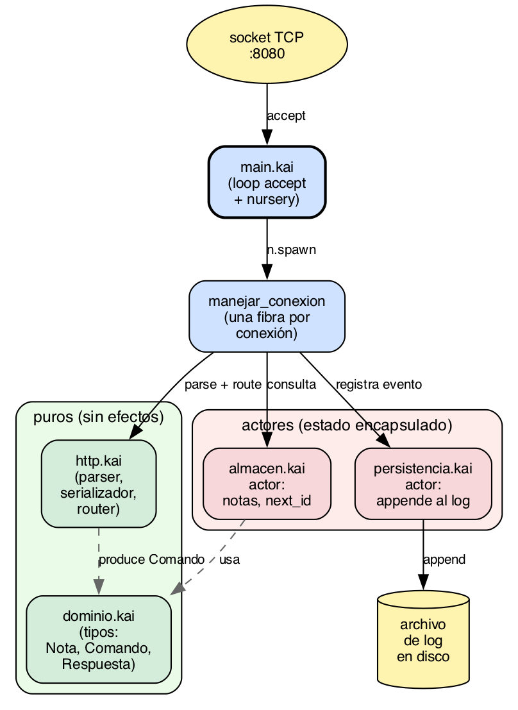

# Capítulo 17 · Caso de estudio: servidor HTTP

Llegamos al primero de dos casos de estudio que cierran el
libro. La idea es ver, en un solo lugar, cómo las piezas de
los capítulos anteriores encajan en algo que se parece a
software real. Desconfío de los libros de lenguajes que nunca
salen del ejemplo de juguete, así que quise cerrar este con dos
programas que podrían estar en producción.

Este capítulo cubre **un servidor HTTP**: la familia de
problemas donde lo que pesa es la concurrencia, la
modularidad y la separación entre lógica de dominio e IO. El
capítulo 18 cubrirá el otro extremo del espectro de la
industria: **un libro mayor contable**, donde lo que pesa son
los tipos precisos (monedas con unidades), las invariantes de
negocio (contratos `requires`/`ensures`), y la inmutabilidad
estricta. Son dos casos del mismo lenguaje, con énfasis distintos.

El programa es un **servidor HTTP de notas**. Tiene una
interfaz HTTP simple (`GET /notas`, `POST /notas`,
`GET /notas/<id>`, `DELETE /notas/<id>`), mantiene las notas
en memoria, y escribe cada cambio a un archivo de log. La
parte "real" no es la lógica (que es simple), sino cómo se
arma: efectos en las firmas, actores para encapsular estado,
fibras para servir conexiones concurrentes, módulos para
separar dominio, parser HTTP, almacenamiento, persistencia.

Tamaño del programa: unas 250 líneas, repartidas en cinco
archivos.

## 17.1 La forma del programa

Antes del código, veamos las piezas y sus responsabilidades:

```
notas/
├── kai.toml             # manifest del proyecto
├── main.kai             # punto de entrada y bucle de accept
├── dominio.kai          # tipos: Nota, Comando, Respuesta
├── almacen.kai          # actor que guarda las notas
├── persistencia.kai     # actor que escribe el log a disco
└── web.kai              # parser y serializador HTTP mínimos
```

Son cinco archivos, y cada uno carga con una preocupación
distinta:

- **`dominio.kai`** es el centro. Tipos puros, sin efectos, sin
  IO. Lo que el dominio "es": qué es una nota, qué comandos se
  pueden ejecutar, qué respuestas se pueden producir.
- **`almacen.kai`** es un actor. Recibe comandos, mantiene la
  lista de notas como estado interno, responde al que pregunta.
  Por dentro la lógica de manipulación es pura (función
  `procesar`), envuelta en un bucle `Actor.receive()` que la
  conecta al mundo.
- **`persistencia.kai`** es otro actor. Recibe eventos
  (creación, borrado), los escribe a un archivo de log. Aislar
  el disco en un actor nos permite que el almacén siga
  respondiendo aunque la escritura sea lenta.
- **`web.kai`** son funciones puras: parsear bytes HTTP en una
  estructura `ReqHttp`, traducir requests en comandos de
  dominio, serializar respuestas a bytes. Sin actores, sin IO.
- **`main.kai`** arma todo: arranca los actores, levanta el
  socket TCP, abre un nursery, y por cada conexión nueva lanza
  una fibra que la maneja.

Esta separación es la forma natural en kaikai. Cada módulo es
ortogonal: la lógica pura del dominio se puede testear sin
arrancar fibras, el parser HTTP sin abrir sockets, el almacén
sin tocar el disco. El `main` solo conecta las piezas.



Figura 17.1 · *Arquitectura del servidor de notas. Cinco
módulos, dos actores (almacén y persistencia), una fibra
por conexión entrante. Los módulos puros (`dominio.kai`,
`web.kai`, cluster verde) no tienen efectos; los módulos
con estado (`almacen.kai`, `persistencia.kai`, cluster
rojo) esconden su mutación detrás de un mailbox; `main.kai`
es pegamento.*

## 17.2 El dominio: tipos puros

Empezamos por el centro. `dominio.kai`:

```kai
#[derive(Show)]
pub type Nota = { id: Int, cuerpo: String }

pub type Comando
  = Listar
  | Obtener(Int)
  | Crear(String)
  | Borrar(Int)

pub type Respuesta
  = Guardado(String)
  | Creado(Nota)
  | NoEncontrado
  | ErrorCliente(String)
  | ErrorServidor(String)
```

Tres declaraciones. Una nota tiene id y cuerpo. Hay cuatro
comandos que se pueden ejecutar contra el dominio (listar,
obtener uno, crear, borrar). Hay cinco respuestas posibles, que
mapean conceptualmente a códigos HTTP 200, 201, 404, 400 y 500.

Lo que **no** hay en este archivo: nada de HTTP, nada de fibras,
nada de archivos. Si un día decides exponer la API por gRPC en
vez de HTTP, este archivo no cambia. Si decides cambiar el
almacenamiento de memoria a SQLite, este archivo no cambia. Es
el invariante del programa.

El `#[derive(Show)]` sobre `Nota` es lo que nos permite
interpolar `#{nota}` en un string (cap. 9). Sin él, tendríamos
que escribir un `impl Show for Nota` a mano.

## 17.3 El almacén: actor con estado

`almacen.kai` define un actor que mantiene la lista de notas y
responde comandos. Su tipo de mensaje es el comando más el
`Pid` para responder:

```kai
import actor
import dominio

pub type AlmacenMsg = Pregunta(dominio.Comando, Pid[AlmacenResp])
pub type AlmacenResp = Respondido(dominio.Respuesta)
```

`AlmacenMsg` es lo que el almacén recibe; `AlmacenResp` es lo
que devuelve. El cliente, antes de mandar, abre su propio
mailbox con `with_mailbox`, mete el `Pid` en el mensaje, y
después espera la respuesta. Es el patrón request/reply del
§14.5.

El corazón del módulo es la **lógica pura** de procesamiento:

```kai
pub fn procesar(c: dominio.Comando, notas: [dominio.Nota], next_id: Int)
    : (dominio.Respuesta, [dominio.Nota], Int) {
  match c {
    Listar -> {
      let cuerpos = list.map(notas, .cuerpo)
      (dominio.Guardado(serializar_lista(cuerpos)), notas, next_id)
    }
    Obtener(id) ->
      match buscar(notas, id) {
        Some(n) -> (dominio.Guardado(n.cuerpo), notas, next_id)
        None    -> (dominio.NoEncontrado, notas, next_id)
      }
    Crear(cuerpo) -> {
      let nueva = dominio.Nota { id: next_id, cuerpo: cuerpo }
      (dominio.Creado(nueva), [nueva, ...notas], next_id + 1)
    }
    Borrar(id) ->
      match buscar(notas, id) {
        Some(_) -> {
          let restantes = list.filter(notas, (n) => n.id != id)
          (dominio.Guardado("borrada"), restantes, next_id)
        }
        None -> (dominio.NoEncontrado, notas, next_id)
      }
  }
}
```

Una sola función, sin efectos en su firma. Recibe el comando,
las notas actuales y el próximo id; devuelve la respuesta, la
nueva lista de notas y el nuevo próximo id. Pattern match
exhaustivo sobre las cuatro variantes de `Comando`. Listas
construidas con `[h, ...tail]`. `list.map` y `list.filter`.
Nada de esto es nuevo del cap. 17: son las construcciones del
cap. 5 (sum types y match) y el cap. 6 (funciones y pipelines)
puestas a trabajar.

Como `procesar` es pura, es **directamente testeable**:

```kai
test "crear y obtener" {
  let (r1, n1, id1) = procesar(dominio.Crear("primera"), [], 1)
  let creado_ok = match r1 {
    dominio.Creado(_) -> true
    _                  -> false
  }
  assert creado_ok
  assert id1 == 2

  let (r2, _, _) = procesar(dominio.Obtener(1), n1, id1)
  let obtener_ok = match r2 {
    dominio.Guardado(c) -> c == "primera"
    _              -> false
  }
  assert obtener_ok
}
```

No hay fibras ni IO ni sockets: solo lógica. Si el día de
mañana queremos paralelizar la creación de notas, agregar
índices, cambiar el algoritmo de búsqueda, todos los cambios
pasan por esta función pura y se prueban aquí.

Encima de `procesar` viene el **bucle del actor**, que la
conecta a `Actor.receive()`:

```kai
fn bucle(notas: [dominio.Nota], proximo_id: Int)
    : Unit / Actor[AlmacenMsg] + Actor[AlmacenResp] {
  match Actor.receive() {
    Pregunta(comando, cliente) -> {
      let (resp, notas_nuevas, id_nuevo) =
        procesar(comando, notas, proximo_id)
      Actor.send(cliente, Respondido(resp))
      bucle(notas_nuevas, id_nuevo)
    }
  }
}
```

Tres líneas de trabajo:

1. Recibe una pregunta.
2. Procesa (lógica pura).
3. Responde y recursa con el estado nuevo.

La recursión por cola se compila a un loop (cap. 6), así que el
actor puede correr indefinidamente. Y la firma declara los dos
efectos que el actor produce: `Actor[AlmacenMsg]` para recibir,
`Actor[AlmacenResp]` para responder.

El helper `arrancar` arma todo:

```kai
pub fn arrancar() : Pid[AlmacenMsg] / Spawn + Cancel + Actor[AlmacenMsg] + Actor[AlmacenResp] {
  spawn_actor(() => bucle([], 1))
}
```

Y un wrapper sincrónico para clientes:

```kai
pub fn preguntar(almacen: Pid[AlmacenMsg], c: dominio.Comando)
    : dominio.Respuesta / Actor[AlmacenMsg] + Actor[AlmacenResp] + Cancel {
  Actor.send(almacen, Pregunta(c, Actor.self()))
  match Actor.receive() {
    Respondido(r) -> r
  }
}
```

`preguntar` es lo que llaman los handlers HTTP del `main`:
"hazle esta pregunta al almacén y dame la respuesta". Por
adentro es un send seguido de un receive. Lo expone como una
función simple, no como un protocolo abierto.

## 17.4 Persistencia: actor de escritura

`persistencia.kai` es más simple. Un actor que recibe líneas
de log y las agrega a un archivo:

```kai
import actor
import fs.file

pub type Evento = Linea(String)

fn bucle(path: String) : Unit / Actor[Evento] + File {
  match Actor.receive() {
    Linea(s) -> {
      file.append(path, s ++ "\n")
      bucle(path)
    }
  }
}

pub fn arrancar(path: String)
    : Pid[Evento] / Spawn + Cancel + Actor[Evento] + File {
  file.write(path, "")    # trunca al inicio
  spawn_actor(() => bucle(path))
}
```

Aislar la escritura a archivo en su propio actor tiene dos
beneficios:

- **El almacén no espera al disco.** Cuando el almacén procesa
  un `Crear`, manda un mensaje al actor de persistencia y
  vuelve a su trabajo. La escritura ocurre en otra fibra.
- **El orden de las escrituras está garantizado.** Todos los
  eventos pasan por el mismo mailbox, que se procesa en orden
  FIFO. No hay races aunque varios handlers escriban al log al
  mismo tiempo.

En un sistema real, este actor tendría un mailbox `Bounded(N,
DropOldest)` para protegerse de inundación. Aquí usamos el
mailbox predeterminado (Unbounded) por simplicidad del demo. La decisión es
explícita y vive en una sola línea, fácil de cambiar.

## 17.5 Parser HTTP

`web.kai` es código puro de string manipulation. La pieza
central es `enrutar`, que traduce un request HTTP en un
comando del dominio:

```kai
pub fn enrutar(req: ReqHttp) : Result[dominio.Comando, dominio.Respuesta] {
  if req.metodo == "GET" {
    if req.path == "/notas" {
      Ok(dominio.Listar)
    } else {
      enrutar_id(req.path, (id) => dominio.Obtener(id))
    }
  } else if req.metodo == "POST" {
    if req.path == "/notas" {
      Ok(dominio.Crear(req.cuerpo))
    } else {
      Err(dominio.NoEncontrado)
    }
  } else if req.metodo == "DELETE" {
    enrutar_id(req.path, (id) => dominio.Borrar(id))
  } else {
    Err(dominio.NoEncontrado)
  }
}
```

El tipo de retorno usa `Result` de forma poco ortodoxa: `Ok`
contiene un comando para ejecutar; `Err` contiene una
respuesta inmediata (404, 400). Esa convención mantiene la
firma compacta: o el request se traduce a un comando válido,
o tenemos la respuesta directamente.

Hay también un parser de la primera línea HTTP (`GET /path
HTTP/1.1`) y un serializador que produce los bytes de
respuesta. Son funciones puras sin efectos, testeables con
strings de entrada y comparación de salida.

## 17.6 El main: armar todas las piezas

`main.kai` es el pegamento que arma las piezas:

```kai
import actor
import spawn
import fs.file
import dominio
import almacen
import persistencia
import net.tcp
import web

const PUERTO : Int = 8080
const PATH_LOG : String = "notas.log"

fn main() : Unit / Console + NetTcp + File + Spawn + Cancel + Actor[almacen.AlmacenMsg] + Actor[almacen.AlmacenResp] + Actor[persistencia.Evento] {
  let almacen_pid = almacen.arrancar()
  let log_pid     = persistencia.arrancar(PATH_LOG)

  match NetTcp.listen("0.0.0.0", PUERTO) {
    Err(msg) -> println("error al levantar el servidor: " ++ msg)
    Ok(listener) -> {
      println("servidor escuchando en puerto #{PUERTO}")
      aceptar_loop(listener, almacen_pid, log_pid)
    }
  }
}
```

Cuatro líneas de "negocio":

1. Arrancar el almacén (actor que mantiene las notas).
2. Arrancar el persistor (actor que escribe el log).
3. Abrir un socket TCP en el puerto.
4. Entrar al bucle de aceptación.

La fila de efectos del `main` lista todo lo que el programa
usa: `Console` para imprimir, `NetTcp` para sockets, `File` para
escribir, `Spawn + Cancel` para fibras, `Actor[X]` para cada uno
de los tres canales de mensajes. La firma no oculta nada: si
el `main` hiciera más cosas, su fila crecería en consecuencia.

El bucle de aceptación abre un nursery y por cada conexión
nueva lanza una fibra. Ojo: `n` no es un valor de tipo
`Nursery` que pueda viajar a otra función: el compilador
reescribe cada `n.spawn(...)` en `Spawn.spawn(...)`
etiquetado con el brand de *este* nursery, así que el `spawn`
tiene que aparecer léxicamente dentro del bloque. Por eso el
bucle accept va inline:

```kai
nursery { n ->
  forever(() => match NetTcp.accept(listener) {
    Err(_)   -> ()
    Ok(conn) -> {
      let _ = n.spawn(() => manejar_conexion(conn, almacen_pid, log_pid))
      ()
    }
  })
}
```

Cada conexión vive en su propia fibra. El nursery garantiza
que cuando el bucle termine (porque alguien cancela el
listener, o el programa recibe SIGINT), las fibras hijas
también terminan. No hay handlers de conexión zombies.

Y por cada conexión, el handler:

```kai
fn manejar_conexion(conn, almacen_pid, log_pid) {
  let raw = leer_request(conn)
  let resp = match web.parsear_request(raw) {
    Err(msg) -> dominio.ErrorCliente(msg)
    Ok(req)  -> match web.enrutar(req) {
      Err(r)        -> r
      Ok(comando)   -> {
        registrar(log_pid, comando)
        almacen.preguntar(almacen_pid, comando)
      }
    }
  }
  NetTcp.send(conn, string_to_bytes(web.serializar_respuesta(resp)))
  NetTcp.close(conn)
}
```

Lee bytes, parsea HTTP, enruta a un comando, registra en el
log, consulta al almacén, serializa la respuesta, escribe al
socket, cierra. Cada paso es una función pura o un mensaje a
un actor. No aparece memoria compartida en ninguna parte, ni
hace falta un solo lock.

## 17.7 Lo que está ocurriendo, en términos del libro

Vale enumerar qué piezas del libro se usan, una a una:

- **Cap. 2** (pensar en kaikai): las funciones son
  expresiones; `procesar` devuelve una tupla en una sola
  expresión.
- **Cap. 4** (tipos compuestos): tuplas de retorno
  (`(Respuesta, [Nota], Int)`), records (`Nota`), listas con
  pattern de cabeza y cola.
- **Cap. 5** (sum types y match): `Comando`, `Respuesta`,
  `Evento` son sum types; los match cubren todas las
  variantes; la exhaustividad la verifica el compilador.
- **Cap. 6** (funciones y pipelines): `list.map`,
  `list.filter` sobre la lista de notas; closures pasadas a
  esas funciones.
- **Cap. 7** (pruebas): tests sobre `procesar` que verifican
  la lógica sin arrancar fibras.
- **Cap. 8** (módulos): cinco archivos cada uno con su `pub`,
  imports entre ellos.
- **Cap. 9** (protocolos): `#[derive(Show)]` para interpolar
  notas.
- **Cap. 12** (efectos): cada función declara su fila;
  `handle` no aparece directamente porque los `handle`s viven
  dentro de `with_mailbox` y `spawn_actor` del stdlib.
- **Cap. 13** (fibras): `nursery` para estructurar el bucle de
  aceptación; cada conexión es una fibra.
- **Cap. 14** (actores): el almacén y la persistencia son
  actores; `with_mailbox` en cada cliente; `spawn_actor` para
  arrancarlos; mensajes tipados.
- **Cap. 16** (tooling): `kai run main.kai` lo arranca; `kai
  test` corre los tests del módulo `almacen`.

No hay nada nuevo aquí en términos de sintaxis. Lo nuevo es la
combinación: piezas pequeñas, ortogonales, encajando en un
programa con responsabilidades reales.

## 17.8 Cómo extenderlo

Hay varias direcciones donde el lector puede llevar este
programa para profundizar lo que aprendió:

- **Persistencia con recovery.** Hoy el log es write-only. Si
  el servidor se reinicia, las notas se pierden. Una extensión
  natural: al arrancar, leer el log y reconstruir el estado.
- **Búsqueda por contenido.** El comando `Obtener` busca por
  id. Agregar un `Buscar(String)` que filtre por substring del
  cuerpo. La lógica pura va en `procesar`; el `match` del
  `enrutar` HTTP gana un brazo.
- **TTL por nota.** Cada nota tiene una expiración. El
  almacén, en cada `Obtener`, verifica si la nota expiró y la
  borra si sí. El campo `created_at` se agrega a `Nota`; el
  efecto `Time` aparece en la fila del `bucle`.
- **Múltiples instancias.** Hoy hay un solo almacén. Para un
  servicio más grande, particionar las notas en varios actores
  por hash del id. El `main` arranca N almacenes y enruta cada
  request al actor que corresponda.
- **Métricas.** Un cuarto actor que recibe eventos
  (`request_recibido`, `nota_creada`, `error_emitido`) y
  acumula contadores. El `main` lo arranca, los handlers le
  mandan eventos, un endpoint `GET /metricas` lee.
- **Test de integración.** Un programa cliente que abre una
  conexión TCP al servidor, manda un request, lee la
  respuesta, verifica que sea lo esperado. Pone el servidor en
  un nursery, corre el cliente, cierra.

Cada una es una sesión de tarde. Ninguna requiere cambiar la
estructura básica: un dominio puro, actores con estado,
fibras para concurrencia, módulos para separación.

## 17.9 Lo que muestra este caso

Hay un patrón claro en lo que acabamos de armar:

- **El dominio es puro.** `Comando`, `Respuesta`, `procesar`:
  tipos y funciones sin efectos. Se testean con entradas y
  salidas, sin arrancar nada.
- **Los actores envuelven el estado mutable.** El almacén
  mantiene la lista de notas; el persistor mantiene el archivo
  de log. La mutación queda encerrada dentro de cada actor,
  invisible para el resto del programa.
- **Las fibras paralelizan el trabajo concurrente
  (cooperativamente).** Una fibra por conexión. El nursery
  garantiza que ninguna sobreviva al servidor.
- **Los módulos separan responsabilidades.** Cinco archivos
  para cinco temas, y cualquiera se puede reemplazar sin tocar
  los otros tres.

El cap. 18 va a aplicar exactamente el mismo patrón a un
dominio muy distinto (contabilidad financiera) y vas a ver
cómo la estructura se mantiene aunque el problema cambie. El
cierre del libro viene allá.
