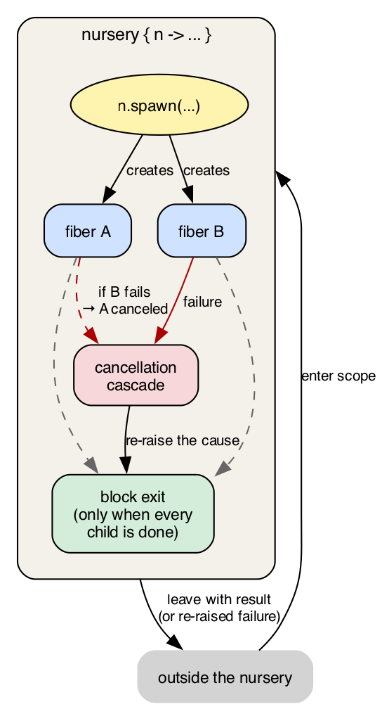

# Chapter 13 · Concurrency and memory

Concurrency is where most languages accumulate debt. Threads
with shared memory lead to races that show up once a month
and get fixed three times; `async`/`await` introduces
function colors; actors fix the previous problems but
historically come with a GC and a heavy runtime.

kaikai bets on an unusual combination: **cooperative fibers +
per-fiber memory + Perceus**. The structure has three
consequences worth naming before the syntax:

- **No shared memory between fibers.** Each fiber has its own
  heap. What one passes to another is copied or moved.
  Goodbye data races by construction.
- **No GC, no borrow checker.** Perceus frees memory when
  the last use of each value ends, without an asynchronous
  collector and without asking the programmer to annotate
  lifetimes. The compiler figures out where to put the
  `free`s by analysing the program.
- **Concurrency is an effect.** `spawn` is an operation of a
  `Spawn` effect, not a keyword. Creating and awaiting
  fibers composes with the rest of the system (`State`,
  `Fail`, `Cancel`) using the chapter-12 machinery.

Let's take it piece by piece.

## 13.1 The model: isolated fibers

A **fiber** is a unit of execution similar to a thread, but
much lighter: on the order of hundreds of bytes instead of
megabytes. A kaikai application can have thousands or
hundreds of thousands of live fibers without breaking a
sweat.

Fibers are **cooperative**. Each one runs until it hits a
**yield point**: a call that voluntarily hands control back
to the scheduler. Yield points are explicit:

- `spawn.yield()`: "I've run for a while, try another".
- `spawn.await(f)`: "wait until fiber `f` finishes".
- IO operations that the scheduler intercepts (network
  reads, sleep, etc.).

Without yields, a fiber runs to completion. That's **local
determinism**: inside a block without yields, you know
exactly what's happening. Compared to preemptive threads, it
takes away a whole class of bugs: there's no race over data
you touch between two yields because nobody can interrupt
you.

The trade-off is that a fiber that never yields blocks every
other one. It's the programmer's responsibility to add yields
where they make sense. In practice, IO calls already include
them, and the only case where you have to think about manual
yields is a tight CPU-heavy loop.

### Per-fiber memory

Each fiber has its **own heap**. When a fiber creates a
record, a list, a closure, the space comes from that heap.
Another fiber can't touch it: can't read it, can't write it.
The type system guarantees this.

How do two fibers communicate, then? By passing values. When
a fiber sends a message to another (via an actor mailbox or
the result of an `await`), the value is copied to the
receiver's heap. For small types that's trivial; for big
structures, kaikai uses Perceus to move instead of copy when
the sender no longer uses the value.

The guarantee that matters: **there's no way for two fibers
to hold a pointer to the same object**. Data races, memory
visibility problems, cache coherence bugs — everything that
in traditional threads needs `Atomic` reads/writes or locks
simply doesn't exist here. Concurrency is by message, not
by shared memory.

## 13.2 Perceus in one page

How is memory freed? Without GC and without a borrow
checker, there's a third approach: **strict reference
counting driven by Perceus** (Lorenz, Leijen, Reinking,
2021).

The idea is that the compiler analyzes each function to find
the exact point where each value is last used. At that
point, it inserts an instruction that decrements the value's
reference count: if it hits zero, the value is freed; if
not, it stays for another use.

```kai
fn example(xs: [Int]) : Int {
  let n = list.length(xs)   # first use of xs
  let s = list.sum(xs)       # last use of xs: consumed here
  s + n                      # xs no longer exists; n and s do
}
```

Compared to a GC:

- **No pause.** Freeing is synchronous, predictable, part of
  the generated code.
- **No asynchronous overhead.** The compiler knows the exact
  lifetime of each value.
- **No separate thread.** The scheduler doesn't compete with
  a collector.

Compared to a borrow checker:

- **No lifetime annotations.** No `'a`, no `&`, no `mut`.
- **No restrictions on use patterns.** If you need two
  references to the same value, the compiler inserts the
  necessary increments and decrements.

The cost? When a value is used many times, counters move.
For heavily shared values that adds overhead, and Perceus
includes aggressive optimizations to minimize it (reuse in
place: if a value is about to be freed and a value of the
same shape is needed immediately after, the same memory is
reused without touching the counter). In practice the cost
is low and predictable.

Why this matters for concurrency: Perceus works per fiber.
Each fiber has its own counters, its own frees. There's no
synchronization between fibers for any counter: no two
fibers ever share pointers to a value with a shared count.
That's why the "isolated fibers" model fits so cleanly with
Perceus: the same invariant that rules out data races also
keeps the reference counting lock-free.

## 13.3 Creating and awaiting fibers: the basic operations

The simplest way to use fibers is with `spawn.spawn` and
`spawn.await`:

```kai
import spawn

fn worker(tag: String, n: Int) : Unit / Stdout + Spawn {
  if n > 0 {
    println(tag)
    spawn.yield()
    worker(tag, n - 1)
  }
}

fn main() {
  let f = spawn.spawn(() => worker("B", 3))
  worker("A", 3)
  spawn.await(f)
}
```

Output:

```
$ kai run examples/ch13/01_two_fibers.kai
A
B
A
B
A
B
```

Reading literally:

- `import spawn` brings in the fiber operations.
- `spawn.spawn(() => worker("B", 3))` creates a new fiber
  that will run the lambda when the scheduler picks it.
- `worker("A", 3)` runs in the current fiber (`main`'s).
- `spawn.yield()` inside `worker` hands control back. On
  each yield, the other fiber gets its turn.
- `spawn.await(f)` waits for `f` to finish before `main`
  returns.

`Spawn` appears in `worker`'s signature because the function
calls `spawn.yield()`, which is a `Spawn` operation. The row
propagates upward like any other effect from chapter 12.

### Why yields are explicit

In languages with preemptive threads (Java, Go, Rust with
`std::thread`), the scheduler can interrupt a thread at any
instruction. That forces you to program as if any line
could be interrupted by another fiber modifying shared
data.

In kaikai, **a fiber keeps running until it hits a yield
point**. Between yields, you have local determinism: if you
modify a local value, nobody else will touch it until you
give up control. This drops a lot of cognitive load.

In exchange, you have to **remember to yield**. The mental
rule: if your function has a long pure-CPU loop, add a
`spawn.yield()` every so many iterations. IO functions
already yield internally.

## 13.4 Nurseries: structured concurrency

`spawn.spawn` + `spawn.await` works, but it has a problem:
if you forget the `await`, the fiber outlives the scope that
created it. And if that fiber fails, you find out late or
not at all.

**Nurseries** tie fibers to a lexical scope. A fiber can
only live inside a nursery, and the nursery waits for all
its children before exiting.

```kai
import spawn

fn worker(tag: String, n: Int) : Unit / Stdout + Spawn {
  if n > 0 {
    println(tag)
    spawn.yield()
    worker(tag, n - 1)
  }
}

fn main() : Unit / Stdout + Spawn + Cancel {
  nursery { n ->
    let a = n.spawn(() => worker("A", 3))
    let b = n.spawn(() => worker("B", 3))
    n.await(a)
    n.await(b)
  }
}
```

`nursery { n -> ... }` opens a scope. Inside, `n` is the
capability to create and await fibers:

- `n.spawn(f)` creates a child fiber. Returns a `Fiber[T]`
  where `T` is what `f` returns.
- `n.await(f)` waits for that fiber and returns its value.
- `n.select([a, b, ...])` waits for any one to finish and
  cancels the others.
- `n.cancel(f)` cancels a specific fiber.
- `n.cancel_all()` cancels all children.

What the nursery guarantees:

- **By block exit, all children have finished.** No leaks: a
  fiber doesn't outlive the `nursery` that created it.
- **If a child fails with an unhandled effect, the others
  are canceled.** The nursery collects the cause and
  re-raises it.
- **If the nursery is canceled from outside, the
  cancellation propagates to all children.**



Figure 13.1 · *Structured concurrency in one picture. The
nursery is a lexical scope; child fibers live inside; nothing
escapes. If one child fails, the nursery cancels the rest
before re-raising; if the parent is canceled from outside,
the cascade flows down.*

This is called **structured concurrency**. The idea is
Nathaniel Smith's, in his essay *"Notes on structured
concurrency, or: Go statement considered harmful"* (2018),
and appears also in Trio, Kotlin coroutines, Swift, and
OCaml 5 Eio. kaikai's version integrates the pattern into
the effect system: the `Spawn` capability is only available
inside a nursery, and that's what the type system enforces.

### Why `Cancel` appears in `main`'s signature

Notice that `main` declares `/ Stdout + Spawn + Cancel`.
Why `Cancel`? Because each `spawn`, `await`, and `select` is
a yield point, and every yield point can receive a
`Cancel.raise()` from the scheduler (if someone cancels the
nursery from outside, or if a sibling fiber fails). Every
function using `Spawn` implicitly carries `Cancel`.

### `nursery` is sugar over `handle`

`nursery { n -> ... }` looks like a language keyword but
it isn't. Fibers are **an effect** called `Spawn`, declared
in the stdlib:

```kai
effect Spawn {
  spawn[T, e](f: () -> T / e) : Fiber[T]
  await[T](f: Fiber[T])       : T
  select[T](fs: [Fiber[T]])   : T
  yield()                     : Unit
  cancel[T](f: Fiber[T])      : Unit
}
```

It's an ordinary effect, declared the same way `Log` or
`State[T]` were in chapter 12. And `nursery { n -> body }`
is rewritten at compile time to `handle { body } with Spawn
as n { ... }`, with an internal handler that manages the
child tree, waits for pending children on exit, and
propagates failures.

That means the language core **has no concurrency
primitives**: it has effects. Fibers, nurseries, and
cancellation are a library built on two stdlib effects
(`Spawn` and `Cancel`). Chapter 14 will do the same for
actors (effect `Actor[Msg]`), and the pattern repeats:
what's distinctive about kaikai isn't the list of
constructs, but that **all of them are the same construct**
(algebraic effects) under different names.

## 13.5 Cooperative cancellation

Cancellation in kaikai is **cooperative**: the scheduler
doesn't kill a fiber outright. It delivers a `Cancel.raise()`
at the next yield point. The fiber can:

- **Unwind cleanly.** If it doesn't handle `Cancel`, the
  unwinding pulls it out of any `handle`, `nursery`, etc.,
  and the cancellation handlers above take control.
- **Handle `Cancel` to clean up.** The fiber installs a
  `Cancel` handler that runs the cleanup (close files,
  release connections) and does NOT call `resume`, letting
  the unwinding continue.

```kai
fn long_worker(tag: String) : Unit / Stdout + Spawn + Cancel {
  handle {
    count(tag, 0)
  } with Cancel {
    raise(resume) -> {
      println("#{tag}: canceled, doing cleanup")
      # not calling resume: the fiber unwinds
    }
  }
}

fn count(tag: String, n: Int) : Unit / Stdout + Spawn + Cancel {
  println("#{tag}: #{n}")
  spawn.yield()
  count(tag, n + 1)
}
```

`long_worker` counts indefinitely. If the nursery cancels
it, the `Cancel` handler prints its message and the fiber
exits. It doesn't hang, it doesn't kill the process.

The conceptual key: `Cancel.raise()` is the **operation**,
and `handle ... with Cancel { ... }` is the handler. Same
pattern as chapter 12: cancellation is another effect, with a
handler written by the user or installed by the runtime.

### `Spawn.cancel(f)` and user-installed `Cancel` handlers

Two related names worth pinning apart:

- **The `Cancel` effect** is what a fiber **receives** when
  cancellation reaches it. Its single op `raise()` is injected
  by the scheduler at the next yield point.
- **`Spawn.cancel(f)`** is what a fiber **calls** to ask the
  scheduler to deliver `Cancel.raise()` to fiber `f`.

When you `n.spawn(...)` with a nursery cap `n` and get back a
child fiber, `Spawn.cancel(child)` does not kill it: it
schedules the delivery. The child, on its next yield, receives
`Cancel.raise()` and its own `Cancel` handler runs — exactly
the one the child installed with `with Cancel { ... }`. If it
installed none, the fiber unwinds cleanly and any handlers
further up the stack (typically the nursery's) take over.

The one exception is **trap-exit** in the actor model
(ch. 14): a fiber can mark itself so that peer crashes turn
into mailbox messages instead of triggering cancellation, but
that's an explicit local opt-in — the default remains the
cooperative cancellation described here.

## 13.6 Per-fiber mutable memory

Chapter 12 §12.7 covered `var` (local cells, sugar over
`State[T]`) and the `Mutable` effect (which rules `Ref[T]`
and `Array[T]` when the mutation is observable). All that
machinery works the same in sequential code, with one
addition that comes from the fiber model: **mutable memory
lives in the heap of the fiber that created it**.

When a fiber creates an `Array[T]` or a `Ref[T]`, the space
comes from its own heap. Another fiber has no way to reach
that memory: no shared pointers, no reference passing
between fibers. If a fiber wants to give a mutable value to
another, it sends it through a mailbox (chapter 14) and the
runtime moves the contents to the receiver's heap.

This is the piece that ensures mutation doesn't introduce
data races in kaikai. In a language with threads and shared
memory, a mutable `Array[T]` needs locks or atomics to be
touched from several threads. In kaikai, the type system
guarantees that no `Array[T]` is being modified by two
fibers at the same time, because no `Array[T]` is reachable
from two fibers at the same time. The memory isolation of
§13.1 covers mutable cells too.

## 13.7 Why fibers can't escape their nursery

A detail of the type system: **`Fiber[T]` is not a movable
value**. You can't return it from a function, can't store
it in an `Option` or a record, can't pass it to another
fiber.

```kai
fn doesnt_compile() : Fiber[Int] {       # ERROR
  nursery { n ->
    n.spawn(() => 42)                     # can't return
  }
}
```

Why? Because a fiber only makes sense inside the nursery
that created it. If you could return it, who would await
it? Who would cancel it if the nursery ends? The structure
breaks.

A list of fibers inside the same nursery is legal:

```kai
nursery { n ->
  let fibers = [1, 2, 3] | (x) => n.spawn(() => process(x))
  fibers | (f) => n.await(f)
}
```

But that list lives inside the nursery. It can't escape.

This closes the model: each fiber has a known parent, each
fiber ends before its parent ends, and the type system
guarantees it syntactically, not by convention. **There's no
way for a fiber to be orphaned.**

## 13.8 Case study: task queue with a worker pool

We close with a classic pattern: a task queue served by a
pool of worker fibers. Each worker takes the next task,
processes it, and goes back for another. When the queue is
empty, they all exit.

```kai
import spawn

effect State[T] {
  get() : T
  set(v: T) : Unit
}

fn next() : Option[String] / State[[String]] {
  match State.get() {
    []           -> None
    [h, ...rest] -> {
      State.set(rest)
      Some(h)
    }
  }
}

fn worker(id: Int) : Unit / Stdout + Spawn + State[[String]] {
  match next() {
    None       -> println("worker #{id}: queue empty, exiting")
    Some(task) -> {
      println("worker #{id}: processing '#{task}'")
      spawn.yield()
      worker(id)
    }
  }
}
```

Up to here, pure effect code: three operations (`get`,
`set`, `next`), a recursion that ends when the queue is
empty. No locks, no atomics, no `Arc<Mutex<...>>`.

The `main` installs the handlers and starts the pool:

```kai
fn main() : Unit / Stdout + Spawn + Cancel {
  handle {
    nursery { n ->
      let a = n.spawn(() => worker(1))
      let b = n.spawn(() => worker(2))
      let c = n.spawn(() => worker(3))
      n.await(a)
      n.await(b)
      n.await(c)
    }
  } with State[[String]](["alpha", "bravo", "charlie", "delta", "echo", "foxtrot"]) {
    get(resume)    -> resume(state)
    set(v, resume) -> resume((), v)
    return(x)      -> x
  }
  println("(all tasks processed)")
}
```

Output:

```
$ kai run examples/ch13/06_task_queue.kai
worker 1: processing 'alpha'
worker 2: processing 'bravo'
worker 3: processing 'charlie'
worker 1: processing 'delta'
worker 2: processing 'echo'
worker 3: processing 'foxtrot'
worker 1: queue empty, exiting
worker 2: queue empty, exiting
worker 3: queue empty, exiting
(all tasks processed)
```

Three fibers share six tasks under cooperative concurrency.
Each one accesses the "shared queue" via the `State`
effect, but underneath there's no shared memory: the
`State` handler lives in `main`, and the fibers'
operations are messages to that handler. The queue is
serialized by construction.

### Concurrency, not parallelism

A precise word matters here. kaikai in v1 runs **on a single
OS thread**: one scheduler, one ready queue. Fibers
interleave cooperatively, but never two fibers execute
instructions at the same wall-clock moment. That's
**concurrency**, not **parallelism**.

Why does this matter? Because if your program is CPU-bound
(numerical computation, compression, rendering), running it
with a hundred fibers won't make it faster: they'll take
turns on the same core. For problems like that, fibers
give you structure (a natural way to express concurrent
work, cancellation, timeouts) but no speedup.

Where fibers do pay off in speed is when the bottleneck is
**IO**: reading files, waiting on the network, waiting on
messages. While one fiber is blocked waiting for bytes,
other fibers run. The same core uses the time that would
otherwise be idle.

Real parallelism (several physical cores working at once)
requires multi-threading, which is out of v1's scope. When
it lands, it'll be on the same fibers-and-actors model: one
scheduler per thread, cooperative fibers inside, messages
between threads. For now, the guarantee is that any code
you write today with fibers and actors will keep working
when multi-threading arrives, just faster on multi-core
machines.

## 13.9 Philosophy: two invariants worth remembering

If you want to keep two things from this chapter, let it be
these:

1. **Each fiber has its own heap.** No shared memory between
   fibers. Communication is by message (actor mailbox,
   `await` result). Data races don't exist by construction,
   not by discipline.

2. **Each fiber has a life tied to a lexical scope.** It
   can't escape the `nursery` that created it; the type
   system rejects any attempt. If the parent ends, every
   child has ended. If a child fails, the siblings are
   canceled.

These two invariants support each other. Memory isolation
is what lets Perceus run per fiber without synchronization.
Lexical structure is what lets memory be freed predictably
at scope exit. Any model that breaks one of the two breaks
the other.

In return, you get whole classes of bugs you no longer
have to think about:

- No `volatile`, no `Atomic`, no memory ordering.
- No `lock`, no `mutex`, no `RwLock`.
- No borrow checker, no `'a` lifetimes, no
  `Rc<RefCell<T>>`.
- No `async fn`, no `Future`, no function colors.
- No GC pause-the-world.

It's a trade-off: you give up the freedom to have arbitrary
pointers between fibers. But the gain — in safety, in
predictability, in mental simplicity — is what justifies the
model.

## Exercises

**13.1.** Modify the §13.3 example (two cooperative fibers)
so that `worker("A")` does 5 iterations and `worker("B")`
does 2. How does the output change? What happens if you
remove the `spawn.yield()`s from one worker only?

**13.2.** A fiber creates an `Array[Int]` locally and
modifies it with `a[i] := v`. Then it exits without passing
it to anyone. Why doesn't this program introduce data races
even if another fiber is running concurrently? Answer in two
lines, in terms of the per-fiber memory model from §13.1.

**13.3.** Implement a function `with_timeout[T](ms: Int, f:
() -> T / Spawn) : Option[T] / Spawn + Cancel + Time`. Use
`n.select` to run `f` against a fiber that does
`Time.sleep(ms)` and returns `None`. Hint: you'll need a
local sum type to distinguish "completed" from "timeout".

**13.4.** In §13.8, the `State` is a FIFO queue with no
priorities. Modify the example so some tasks have high
priority and the workers process those first. Hint: the
`State` can be a record with two lists.

**13.5.** A fiber that enters an infinite loop without
`spawn.yield()` blocks all the others. Write that code and
observe what happens. Then add yields every N iterations.
How often? How do you choose N?

**13.6.** In your usual language, find a concurrent program
you wrote or maintain. Count how many lines are "real work"
(the program's logic) vs how many are "concurrency
plumbing" (mutex, queues, atomics, async/await, callbacks).
Estimate what percentage of the code would remain under
kaikai's model.
