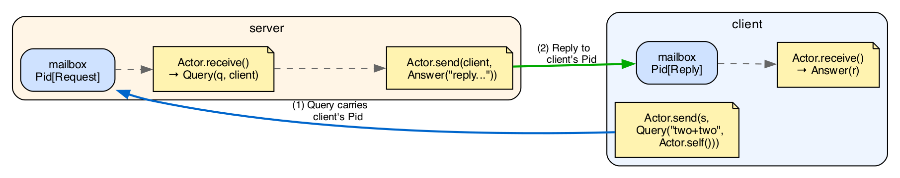

# Chapter 14 · Actors

Chapter 13 showed how to start fibers and coordinate them
with a nursery. That solves internal concurrency: many units
of work inside the same program, sharing CPU cooperatively.

For many cases that structure is enough. But there's a
pattern that pure fibers leave awkward, and it's worth
naming before the syntax.

## An actor is a process; a fiber is a computation

Imagine two different tasks:

- **Task A:** parse a large file and return the list of
  errors found. Starts, works, ends, returns a value.
- **Task B:** maintain an in-memory cache that answers
  queries (`get(key)` and `put(key, value)`). Starts, stays
  alive, answers messages for as long as the program lives,
  ends when someone asks it to stop.

Both are concurrent in the sense that the main program can
keep working while they happen. But their shape is very
different.

Task A is a **computation**: it has an input, produces an
output, ends. That's a **fiber**. You create it with
`spawn`, you wait for its result with `await`, you receive
the value. Once the result is returned, the fiber ceases to
exist.

```kai
let f = spawn.spawn(() => parse_file("input.txt"))
# ... other work in parallel ...
let errors = spawn.await(f)   # one value, and you're done
```

Task B is a **live process**: it has no single return value,
just an endless sequence of interactions. For that, kaikai
borrows the **actor** model, drawn in spirit from Erlang and
BEAM.

```kai
let cache = spawn_actor(() => cache_loop())
Actor.send(cache, Put("user:42", "ada"))
Actor.send(cache, Put("user:43", "turing"))
match Actor.receive() {
  Found(v) -> ...
  Missing  -> ...
}
```

An actor is **a fiber with a typed mailbox on top**. The
fiber is the substrate (a cooperative thread of execution);
the mailbox is what makes it an actor (a channel where
messages pile up for the fiber to process in order).

Side by side:

| Aspect | Fiber | Actor |
|---|---|---|
| What is it? | Unit of execution | Fiber with typed mailbox |
| Communication | One return value via `await` | Messages via `send`/`receive` |
| Lifecycle | Start, compute, return, die | Start, loop processing, die when it decides |
| How to create | `spawn.spawn` or `n.spawn` | `spawn_actor` |
| How you talk to it | `await` to get its `T` | `send` any number of times |
| When to pick | Discrete concurrent computation | Long-lived service, internal state, queries |

The mental rule:

- **Does the task end with a value the parent needs?** Fiber.
- **Does the task live and respond to messages from several
  clients?** Actor.

Both models are **concurrent but not parallel** in v1: the
runtime runs a single OS thread, and fibers and actors
interleave cooperatively on it (chapter 13 §13.8 *Concurrency,
not parallelism*). The benefit is structural and for
IO-bound loads, not multi-core speedup.

Cases where an actor is natural: a cache server, a connection
controller, a process supervisor, a notification router, a
task queue, a logger actor. Cases where a fiber suffices: an
expensive computation the parent wants to run concurrently
with other work, a `with_timeout` measuring how long
something takes, a concurrent map over a list of IO.

## Actors are not language primitives

One more thing to pin down before the syntax: in kaikai,
actors aren't a core construct. They're a **layer built with
algebraic effects**: the `Actor[Msg]` effect declares the
operations (`self`, `send`, `receive`); the stdlib provides
functions like `with_mailbox` and `spawn_actor` that install
the `Actor[Msg]` handler on top of an ordinary fiber.

It's the same principle as `nursery` from chapter 13: the
language core has only effects; the use patterns (fibers,
actors, supervision) appear in libraries any reader can
read. If after this chapter you wonder how `spawn_actor`
works inside, the answer is a `spawn.spawn` plus a
`handle ... with Actor[Msg]`.

## 14.1 `Actor[Msg]`: the effect

An actor is a fiber inside a `handle ... with Actor[Msg]`
that grants it access to three operations. The effect is
declared in the stdlib:

```kai
# Declared in stdlib/actor.kai, accessible via `import actor`.
pub effect Actor[Msg] {
  self()                         : Pid[Msg]
  send(pid: Pid[Msg], msg: Msg)  : Unit / Cancel
  receive()                      : Msg / Cancel
}
```

- **`self()`** returns the `Pid` of the current actor. The
  `Pid` is the handle others use to send it messages.
- **`send(pid, msg)`** enqueues `msg` in `pid`'s mailbox. If
  the mailbox is full, the behavior depends on the policy
  (§14.4).
- **`receive()`** takes the next message from the current
  actor's mailbox. If there's nothing, the fiber suspends
  until one arrives. Because it suspends, it's a yield point
  and carries `Cancel`.

`Msg` is the concrete message type the actor receives.
**An actor handles a single message type.** If you need to
mix shapes, unify them with a sum type:

```kai
type ServerMsg
  = Ping(Pid[Pong])
  | Stop
  | Tick
```

The actor knows it'll receive only one of those three
constructors, and the exhaustive `match` on `receive()`
guarantees you cover every case.

### `Pid[Msg]`: typed handle

A `Pid[Msg]` is a mailbox identifier. It has a type, so the
compiler doesn't let you send a `Notification` message to a
`Pid[Task]`. This is the strongest difference from Erlang:
in Erlang, PIDs are untyped; in kaikai, they're specific to
the message type.

Like `Fiber[T]` from chapter 13, `Pid[Msg]` is **tied to the
scope that created it**. You can't store it in a record that
outlives the nursery, return it from a function outside the
standard family, or pass it between data structures that
aren't approved. The compiler rejects it. This closes the
model: every PID has a known parent, and dies with it.

## 14.2 `with_mailbox`: give the current fiber a mailbox

The simplest way to start is to give a mailbox to the fiber
you're already in. `with_mailbox` installs the `Actor[Msg]`
handler and hands control to its body:

```kai
import actor

fn main() : Unit / Console {
  with_mailbox {
    Actor.send(Actor.self(), "hello")
    Actor.send(Actor.self(), "world")
    Stdout.print(Actor.receive())
    Stdout.print(Actor.receive())
  }
}
```

Output:

```
$ kai run examples/ch14/01_with_mailbox.kai
hello
world
```

`with_mailbox { ... }` is a call with trailing-lambda
syntax: the block in braces is the body that runs with the
mailbox installed. Because `with_mailbox` passes no
arguments to the body (zero-parameter lambda), the block
needs no arrow or binder. Inside, `Actor` is the capability:
`Actor.self()` returns the newly created mailbox's `Pid`,
`Actor.send(pid, msg)` enqueues, `Actor.receive()` takes the
next one.

In this example the actor talks to itself. It's the "hello
world" of the model; the real exercise is communicating two
distinct actors.

## 14.3 `spawn_actor`: start a new actor

To start an actor that runs in its own fiber:

```kai
import actor

fn worker() : Unit / Actor[String] + Console {
  let t1 = Actor.receive()
  Stdout.print("working: " ++ t1)
  let t2 = Actor.receive()
  Stdout.print("working: " ++ t2)
  let t3 = Actor.receive()
  Stdout.print("working: " ++ t3)
}

fn main() : Unit / Console + Spawn + Cancel + Actor[String] {
  with_mailbox {
    let pid = spawn_actor(() => worker())
    Actor.send(pid, "task-1")
    Actor.send(pid, "task-2")
    Actor.send(pid, "task-3")
    spawn.yield()
    spawn.yield()
    spawn.yield()
    spawn.yield()
  }
}
```

`spawn_actor` starts a new fiber, installs a mailbox on it,
and returns the `Pid` so the parent can send it messages.
The worker's signature declares `Actor[String]`: it needs
the effect to call `Actor.receive()`.

Notice that `main` also has `Actor[String]` in its row.
Why? Because `Actor.send(pid, "task-1")` is an invocation of
an operation of the `Actor[String]` effect, and like every
effect operation it requires the effect to be available in
context. The `with_mailbox` in `main` provides that
capability. The `pid` already identifies the destination
mailbox; the handler only dispatches the operation.

The `spawn.yield()`s at the end give the scheduler a chance
to run the worker. Without them, `main` would exit before
the worker processed anything.

### `receive_timeout`: receive with a deadline

`Actor.receive()` blocks: if the mailbox is empty, the fiber
suspends until a message arrives, however long that takes.
That's what you want almost always, but sometimes waiting
forever is precisely what you don't want. A supervisor running
a health check shouldn't hang if the worker stopped responding;
a client asking for something over the network wants to retry
if nobody answers within 50 ms.

That's what `receive_timeout(d)` is for: it receives from the
mailbox, gives up after a `Duration`, and returns an `Option`:

```kai
import actor
import time

fn main() : Unit / Console + Spawn + Cancel + Clock + Actor[String] {
  with_mailbox {
    match receive_timeout(time.millis(10)) {
      Some(m) -> Stdout.print("received: " ++ m)
      None    -> Stdout.print("timeout: nobody answered")
    }
  }
}
```

Output:

```
$ kai run examples/ch14/06_receive_timeout.kai
timeout: nobody answered
received: pong
```

`Some(msg)` if a message arrived before the deadline, `None` if
the deadline elapsed first. The `Duration` comes from `time`'s
constructors (`time.millis`, `time.seconds`, `time.minutes`);
because the deadline is measured against the clock, the
signature gains the `Clock` effect. Having to `match` on the
`Option` is the point: the compiler won't let you forget the
case where time ran out.

For the module's full repertoire — `spawn_actor_policy`, the
typed wrappers, the raw nanosecond op `receive_timeout` is
built on — see `kai doc actor`.

## 14.4 Mailbox policies: what happens when it fills

By default, `with_mailbox` and `spawn_actor` create an
**unbounded** mailbox: it never fills, messages pile up
while they go unread. Reasonable to start, dangerous in
practice: if a producer sends faster than a consumer
processes, memory grows without bound.

For real cases, you pick a policy. The stdlib (module
`actor`) exposes them as two sum types:

```kai
# Defined in stdlib/actor.kai, accessible via `import actor`.
pub type MailboxPolicy = Unbounded | Bounded(Int, Overflow)
pub type Overflow      = DropOldest | DropNewest | BlockSender
```

`Bounded(capacity, on_full)` gives a fixed-size mailbox.
The `on_full` parameter decides what to do when a message
arrives with no room:

- **`DropOldest`**: the oldest message is evicted, the new
  one enters. Useful for snapshots: only the latest state
  matters (telemetry, tick events, GPS).
- **`DropNewest`**: the new message is rejected, the
  mailbox stays as it was. Useful for "first wins" protocols
  (leader election, lock acquisition).
- **`BlockSender`**: the sender suspends until space frees
  up. Useful for **backpressure**: the producer slows down
  when the consumer can't keep up. It's a yield point, so a
  blocked sender can receive `Cancel.raise()`.

```kai
import actor

fn main() : Unit / Console {
  with_mailbox_policy(Bounded(2, DropOldest)) {
    Actor.send(Actor.self(), "a")
    Actor.send(Actor.self(), "b")
    Actor.send(Actor.self(), "c")
    Stdout.print(Actor.receive())
    Stdout.print(Actor.receive())
  }
}
```

Output:

```
$ kai run examples/ch14/04_mailbox_policy.kai
b
c
```

The mailbox has capacity 2. We send `a`, `b`, `c` without
reading anything. When `c` arrives, there's no room, and
`DropOldest` evicts `a`. The two reads recover `b` and `c`.

`DropOldest` and `DropNewest` **don't notify the sender**
that their message was dropped. If you need to know, use
`BlockSender` (or design the protocol with an ack). The
silence is deliberate: the policy expresses a global
preference of the mailbox, not a per-message negotiation.

## 14.5 Request/reply pattern

The most common pattern between actors is to ask one of
them for something and wait for the answer. Each side of
the dialogue has its own message type: the client sends a
`Request` and receives a `Reply`; the server receives
`Request` and sends `Reply`. The `Request` includes the
client's `Pid[Reply]` so the server knows where to reply.

```kai
import actor

type Request = Query(String, Pid[Reply])
type Reply   = Answer(String)

fn server() : Unit / Actor[Request] + Actor[Reply] + Console {
  match Actor.receive() {
    Query(q, client) -> {
      Stdout.print("server: got '#{q}'")
      Actor.send(client, Answer("reply to '#{q}'"))
      server()
    }
  }
}

fn main() : Unit / Console + Spawn + Cancel + Actor[Reply] {
  with_mailbox {
    let s = spawn_actor(() => server())

    Actor.send(s, Query("two+two", Actor.self()))
    match Actor.receive() {
      Answer(r) -> Stdout.print("client: " ++ r)
    }
  }
}
```



Figure 14.1 · *Request/reply between two actors. The client
holds a `Pid[Reply]` mailbox; the server holds a
`Pid[Request]` mailbox. Arrow (1) carries the `Query` —
which includes the client's PID — into the server's
mailbox; arrow (2) returns the `Answer` to the client's
mailbox. Two typed mailboxes, two messages, one round
trip.*

A few things worth noting about the structure:

- **Two distinct types, `Request` and `Reply`**, each with
  its own mailbox. The server declares `Actor[Request] +
  Actor[Reply]` in its row: it receives `Request` from its
  own mailbox and sends `Reply` to the client's mailbox.
  The client declares only `Actor[Reply]`: it has a `Reply`
  mailbox, not a `Request` one. The types tell you exactly
  which mailbox is which.
- **`Query` includes the return `Pid[Reply]`.** Without it,
  the server doesn't know whom to reply to. The `Pid`'s type
  guarantees that only `Reply` messages can be sent to it.
- **The server recurses** after processing the message.
  Without that recursion, the server would process a single
  message and exit. Tail recursion compiles to a loop
  (chapter 6), so the actor can run indefinitely without
  blowing the stack.

This replaces, in practical terms, synchronous API calls:
you ask, wait, continue. The difference is that the
"server" can be serving multiple clients at once, its
internal state is encapsulated, and the type system
guarantees that no client is waiting for an answer of the
wrong type.

## 14.6 Supervision: links and monitors

In BEAM, actors are supervised with **links**
(bidirectional) and **monitors** (unidirectional). When an
actor crashes, the actors watching it find out and decide
what to do.

kaikai ships the same model, expressed as two stdlib
effects:

```kai
# Declared in stdlib/actor.kai, alongside Actor[Msg].
pub effect Link {
  link(pid: Pid[_]) : Unit
}

pub effect Monitor {
  monitor(pid: Pid[_]) : MonitorRef
  demonitor(ref: MonitorRef) : Unit
}
```

`Pid[_]` is an "existential" PID: any message type works.
That's because `link` and `monitor` don't send or receive
messages; they only register observation on the actor's
life.

### Links: bidirectional

`Link.link(pid)` declares that the current actor and `pid`
are bound: if either fails, the other receives
`Cancel.raise()`. It's the pattern for two actors that
depend on each other symmetrically (a worker and its queue,
two sides of a handshake). It is not what you want for
"supervisor watches worker": that's the monitor case.

### Monitors: unidirectional

`Monitor.monitor(pid)` declares that the current actor
wants to know when `pid` ends, without coupling its own
life to the observed actor's. When `pid` ends (normal
return, crash, or cancellation), the observer receives a
`MonitorDown` message in its mailbox. The stdlib exposes
the relevant types:

```kai
# Defined in stdlib/actor.kai along with the Monitor effect.
pub type MonitorDown = MonitorDown(MonitorRef, TerminationCause)
pub type TerminationCause
  = Normal
  | Crashed(String)
  | Cancelled
```

For an actor to receive `MonitorDown`, its message type
must include it as a variant:

```kai
type SupervisorMsg
  = Tick
  | Stop
  | Down(MonitorDown)
```

The supervisor does `Monitor.monitor(worker)` after
creating it, and any worker termination arrives as
`Down(ev)` to the supervisor's main `match`. The supervisor
decides what to do (restart, escalate, ignore) without its
own life being tied to the worker's.

### When to pick each

- **Without `Link` or `Monitor`**, when the natural flow is
  for the actor itself to report how it went before exiting.
  It sends a `Done(...)` or `Failed(...)` message to its
  supervisor and exits cleanly. The supervisor sees it like
  any other message. That's the pattern the case study in
  §14.7 uses.
- **`Monitor`**, when the supervisor needs to react to
  terminations the actor doesn't control: crashes,
  cancellation from outside, panics. The supervisor stays
  alive and decides.
- **`Link`**, when two actors form a unit and it doesn't
  make sense for one to survive without the other.

The §14.7 pattern that follows uses explicit notification
because it's the simplest. The variants that use `Monitor`
or `Link` are refinements worth introducing only when the
message protocol becomes insufficient.

## 14.7 Case study: supervisor with retries

We close with a complete program: a supervisor that
launches a worker with a batch of tasks, watches whether
the batch succeeded, and retries with an alternate batch if
it failed.

```kai
import actor

#[derive(Show)]
type BatchResult
  = Done(Int)             # successful total
  | Failed(String)        # reason for the failure

fn process(tasks: [(Int, Int)], acc: Int) : BatchResult {
  match tasks {
    []                 -> Done(acc)
    [(a, 0), ..._]     -> Failed("division by zero at (#{a}, 0)")
    [(a, b), ...rest]  -> process(rest, acc + (a / b))
  }
}

fn worker(supervisor: Pid[BatchResult], tasks: [(Int, Int)])
    : Unit / Actor[BatchResult] + Console {
  let r = process(tasks, 0)
  Stdout.print("worker: batch ended as #{r}")
  Actor.send(supervisor, r)
}

fn attempt(me: Pid[BatchResult], batch: [(Int, Int)])
    : BatchResult / Console + Spawn + Cancel + Actor[BatchResult] {
  let _ = spawn_actor(() => worker(me, batch))
  Actor.receive()
}

fn supervisor() : Unit / Console + Spawn + Cancel + Actor[BatchResult] {
  with_mailbox {
    let me = Actor.self()
    let first_batch  = [(10, 2), (20, 4), (30, 0)]
    let second_batch = [(10, 2), (20, 4), (30, 5)]
    match attempt(me, first_batch) {
      Done(total)     -> Stdout.print("supervisor: success on first try, total=#{total}")
      Failed(reason)  -> {
        Stdout.print("supervisor: first try failed (#{reason}), retrying")
        match attempt(me, second_batch) {
          Done(total)     -> Stdout.print("supervisor: success on second try, total=#{total}")
          Failed(reason)  -> Stdout.print("supervisor: second try failed too (#{reason}), giving up")
        }
      }
    }
  }
}

fn main() : Unit / Console + Spawn + Cancel {
  supervisor()
}
```

Output:

```
$ kai run examples/ch14/05_supervisor.kai
worker: batch ended as Failed(division by zero at (30, 0))
supervisor: first try failed (division by zero at (30, 0)), retrying
worker: batch ended as Done(16)
supervisor: success on second try, total=16
```

Three pieces worth commenting on:

- **`process` doesn't touch the actor system.** It's pure
  list logic: pattern match, recursion, returns a value.
  That means `process` is completely testable without
  starting fibers. The actor layer lives only in `worker`,
  `attempt`, and `supervisor`.
- **`attempt` separates a concern.** Before extracting it,
  the second-attempt code was inline inside the first
  `match`. Pulling that logic into its own function makes
  the "spawn + receive" pattern explicit.
- **The supervisor decides policy.** The worker is blind to
  the decision: it only reports. Changing the policy from
  "two tries with different data" to "three tries with
  exponential backoff" touches one function. That separation
  is the real benefit of the model.

What's missing for this to be production-ready? A few
things:

- **Per-attempt timeout.** Today if the worker hangs, the
  supervisor hangs too, because `attempt` ends in an
  `Actor.receive()` that blocks with no deadline. Swapping that
  `receive` for `receive_timeout` (§14.3) hands the supervisor a
  `None` to react to instead of waiting indefinitely.
- **Cancel the worker if the supervisor gives up.** If we
  say "I give up" while the worker is still processing, we
  want the worker to end too. With `Link.link(worker)` after
  spawn, the supervisor's decision to return cancels the
  worker automatically. The explicit alternative is to add a
  `Stop` message to the worker's protocol and send it
  before giving up.
- **Persistent logging.** Instead of `Stdout.print`, send to
  a logger actor with its own bounded mailbox
  (`Bounded(1024, DropOldest)`).

Each is an afternoon's work. But the foundation is there:
three actors, two message types, a type system that
guarantees mailboxes are respected.

## 14.8 Philosophy: actors are a library

If you want to keep two things from this chapter, let it be
these:

1. **Actors are not language primitives.** They're a library
   built on the `Actor[Msg]` effect, which is in turn an
   ordinary effect declaration. The stdlib provides
   `with_mailbox`, `spawn_actor`, the policies. The library's
   code is there for you to read. If you ever wonder "what
   does `spawn_actor` do underneath", the answer is a
   `handle` and a `spawn.spawn`.

2. **Every actor has a fixed message type.** The compiler
   guarantees you don't send the wrong message to the wrong
   mailbox. `Pid[Msg]` is typed, not a string. And so an
   actor system in kaikai is more statically verifiable than
   its equivalent in Erlang.

The most important consequence of the first idea: when you
want a supervision pattern the stdlib doesn't provide, you
can write it. The syntax hides nothing: `handle`, `receive`,
`send`. Any actor pattern you've seen in Erlang, Akka, or
any other actor framework should be expressible as an
ordinary function in kaikai with these pieces.

## Exercises

**14.1.** Modify the §14.3 example so the worker processes
five tasks instead of three. What happens if you reduce the
parent's `spawn.yield()`s? What's the minimum that lets all
tasks get processed?

**14.2.** Take `BoundedDropOldest` from §14.4 and change it
to `BoundedDropNewest`. What's the expected output? Justify
by reasoning about which messages remain in the mailbox as
each `send` arrives.

**14.3.** In §14.5's request/reply pattern, the client sends
one question and leaves. If you wanted a client that asks
five questions in series, what would you change? And if you
wanted to fire them all at once and receive replies as they
come in (concurrently, not in parallel: the scheduler
interleaves them on the same thread)? Hint: you'd need to
open several fibers in a nursery or group replies with a
correlation id.

**14.4.** In the §14.7 case study, the supervisor retries
twice. Generalize: write a function `with_retries[T,
e](n: Int, attempt: () -> BatchResult / e) : BatchResult /
e` that retries `n` times before giving up.

**14.5.** A "logger" actor receives `Info(String)` and
prints them to stdout. Design its message type, its
signature, and an appropriate `with_mailbox_policy`. Justify
the choice of policy by considering: what happens if the
producer sends faster than it can be printed?
