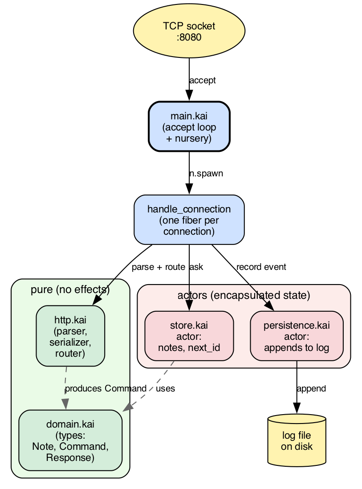

# Chapter 17 · Case study: HTTP server

We've reached the first of two case studies that close the
book. The point is to see, in one place, how the pieces
from the previous chapters fit into something resembling
real software. I distrust language books that never leave the
toy example, so I wanted to close this one with two programs
that could plausibly ship.

This chapter covers **an HTTP server**: the family of
problems where what matters is concurrency, modularity, and
the separation between domain logic and IO. Chapter 18
will cover the other end of the industry spectrum: **a
ledger**, where what matters is precise types (currencies
with units), business invariants (`requires`/`ensures`
contracts), and strict immutability. Two cases of the same
language, with very different things to worry about in each.

The program: a notes server with a simple HTTP interface
(`GET /notes`, `POST /notes`, `GET /notes/<id>`, `DELETE
/notes/<id>`), keeps notes in memory, and writes each
change to a log file. The "real" part isn't the logic
(it's simple), it's how it's wired: effects in the
signatures, actors to encapsulate state, fibers for
concurrent connections, modules to separate domain, HTTP
parser, storage, persistence.

Program size: about 250 lines, across five files.

## 17.1 The shape of the program

Before the code, the pieces and their responsibilities:

```
notes/
├── kai.toml             # project manifest
├── main.kai             # entry point and accept loop
├── domain.kai           # types: Note, Command, Reply
├── store.kai            # actor that holds the notes
├── persistence.kai      # actor that writes the log
└── web.kai              # minimal HTTP parser and serializer
```

The five files split the work into five concerns:

- **`domain.kai`** is the center. Pure types, no effects, no
  IO. What the domain "is": what a note is, what commands
  can be issued, what responses can be produced.
- **`store.kai`** is an actor. Receives commands, holds the
  list of notes as internal state, replies to whoever
  asked. The manipulation logic inside is pure (function
  `process`), wrapped in an `Actor.receive()` loop that
  connects it to the world.
- **`persistence.kai`** is another actor. Receives events
  (creation, deletion), writes them to a log file.
  Isolating the disk in an actor lets the store keep
  responding even if the write is slow.
- **`web.kai`** is pure functions: parsing HTTP bytes into
  a `HttpReq` structure, translating requests into domain
  commands, serializing responses to bytes. No actors, no
  IO.
- **`main.kai`** wires it all: starts the actors, opens the
  TCP socket, opens a nursery, and spawns a fiber for each
  new connection.

This separation is the natural shape in kaikai. Each module
is orthogonal: the pure domain logic can be tested without
starting fibers, the HTTP parser without opening sockets,
the store without touching disk. `main` just connects the
pieces.



Figure 17.1 · *Notes server architecture. Five modules,
two actors (store and persistence), one fiber per
incoming connection. The pure modules (`domain.kai`,
`web.kai`, green cluster) have no effects; the stateful
modules (`store.kai`, `persistence.kai`, red cluster)
hide their mutation behind a mailbox; `main.kai` is glue.*

## 17.2 The domain: pure types

We start in the center. `domain.kai`:

```kai
#[derive(Show)]
pub type Note = { id: Int, body: String }

pub type Command
  = List
  | Get(Int)
  | Create(String)
  | Delete(Int)

pub type Reply
  = Stored(String)
  | Created(Note)
  | NotFound
  | ClientError(String)
  | ServerError(String)
```

Three declarations. A note has an id and a body. Four
commands can be issued against the domain (list, get one,
create, delete). Five possible responses, which map
conceptually to HTTP 200, 201, 404, 400, and 500.

What's **not** here: no HTTP, no fibers, no files. If one
day you decide to expose the API over gRPC instead of
HTTP, this file doesn't change. If you decide to switch
storage from memory to SQLite, this file doesn't change.
It's the program's invariant.

The `#[derive(Show)]` on `Note` is what lets us interpolate
`#{note}` in a string (chapter 9). Without it, we'd have
to write `impl Show for Note` by hand.

## 17.3 The store: actor with state

`store.kai` defines an actor that keeps the list of notes
and answers commands. Its message type is the command plus
the `Pid` to reply to:

```kai
import actor
import domain

pub type StoreMsg = Ask(domain.Command, Pid[StoreResp])
pub type StoreResp = Replied(domain.Reply)
```

`StoreMsg` is what the store receives; `StoreResp` is what
it returns. The client, before sending, opens its own
mailbox with `with_mailbox`, puts the `Pid` in the message,
and then waits for the reply. It's the request/reply
pattern from §14.5.

The heart of the module is the **pure logic** of
processing:

```kai
pub fn process(c: domain.Command, notes: [domain.Note], next_id: Int)
    : (domain.Reply, [domain.Note], Int) {
  match c {
    List -> {
      let bodies = list.map(notes, .body)
      (domain.Stored(serialize_list(bodies)), notes, next_id)
    }
    Get(id) ->
      match find(notes, id) {
        Some(n) -> (domain.Stored(n.body), notes, next_id)
        None    -> (domain.NotFound, notes, next_id)
      }
    Create(body) -> {
      let n = domain.Note { id: next_id, body: body }
      (domain.Created(n), [n, ...notes], next_id + 1)
    }
    Delete(id) ->
      match find(notes, id) {
        Some(_) -> {
          let remaining = list.filter(notes, (n) => n.id != id)
          (domain.Stored("deleted"), remaining, next_id)
        }
        None -> (domain.NotFound, notes, next_id)
      }
  }
}
```

A single function, no effects in its signature. Takes the
command, the current notes, and the next id; returns the
response, the new note list, and the new next id.
Exhaustive pattern match over the four variants of
`Command`. Lists built with `[h, ...tail]`. `list.map` and
`list.filter`. None of this is new in chapter 17: it's the
chapter-5 constructs (sum types and match) and chapter-6
(functions and pipelines) put to work.

Because `process` is pure, it's **directly testable**:

```kai
test "create and get" {
  let (r1, n1, id1) = process(domain.Create("first"), [], 1)
  let created_ok = match r1 {
    domain.Created(_) -> true
    _                  -> false
  }
  assert created_ok
  assert id1 == 2

  let (r2, _, _) = process(domain.Get(1), n1, id1)
  let get_ok = match r2 {
    domain.Stored(c) -> c == "first"
    _             -> false
  }
  assert get_ok
}
```

There are no fibers, no IO, no sockets in sight: it's just
logic. If tomorrow we want to parallelize note creation, add
indexes, or change the search algorithm, all those changes go
through this pure function and get tested here.

On top of `process` sits the **actor loop** that connects it
to `Actor.receive()`:

```kai
fn loop(notes: [domain.Note], next_id: Int)
    : Unit / Actor[StoreMsg] + Actor[StoreResp] {
  match Actor.receive() {
    Ask(command, client) -> {
      let (resp, new_notes, new_id) = process(command, notes, next_id)
      Actor.send(client, Replied(resp))
      loop(new_notes, new_id)
    }
  }
}
```

Three lines of work:

1. Receives an ask.
2. Processes it (pure logic).
3. Replies and recurses with the new state.

Tail recursion compiles to a loop (chapter 6), so the actor
can run indefinitely. And the signature declares the two
effects the actor produces: `Actor[StoreMsg]` to receive,
`Actor[StoreResp]` to reply.

The `start` helper wires it together:

```kai
pub fn start() : Pid[StoreMsg] / Spawn + Cancel + Actor[StoreMsg] + Actor[StoreResp] {
  spawn_actor(() => loop([], 1))
}
```

And a synchronous wrapper for clients:

```kai
pub fn ask(store: Pid[StoreMsg], c: domain.Command)
    : domain.Reply / Actor[StoreMsg] + Actor[StoreResp] + Cancel {
  Actor.send(store, Ask(c, Actor.self()))
  match Actor.receive() {
    Replied(r) -> r
  }
}
```

`ask` is what the HTTP handlers in `main` call: "send this
question to the store and give me the answer". Underneath
it's a send followed by a receive. We expose it as a simple
function, not an open protocol.

## 17.4 Persistence: writing actor

`persistence.kai` is simpler. An actor that receives log
lines and appends them to a file:

```kai
import actor
import fs.file

pub type Event = Line(String)

fn loop(path: String) : Unit / Actor[Event] + File {
  match Actor.receive() {
    Line(s) -> {
      file.append(path, s ++ "\n")
      loop(path)
    }
  }
}

pub fn start(path: String) : Pid[Event] / Spawn + Cancel + Actor[Event] + File {
  file.write(path, "")    # truncate at start
  spawn_actor(() => loop(path))
}
```

Isolating the file write in its own actor has two benefits:

- **The store doesn't wait on disk.** When the store
  processes a `Create`, it sends a message to the
  persistence actor and goes back to its work. The write
  happens in another fiber.
- **Write order is guaranteed.** All events go through the
  same mailbox, which is processed in FIFO order. No races
  even if several handlers write to the log at the same
  time.

In a real system, this actor would have a `Bounded(N,
DropOldest)` mailbox to protect against flooding. Here we
use the default (Unbounded) for simplicity. The decision is
explicit and lives in one line, easy to change.

## 17.5 HTTP parser

`web.kai` is pure string manipulation. The central piece
is `route`, which translates an HTTP request into a domain
command:

```kai
pub fn route(req: HttpReq) : Result[domain.Command, domain.Reply] {
  if req.method == "GET" {
    if req.path == "/notes" {
      Ok(domain.List)
    } else {
      route_id(req.path, (id) => domain.Get(id))
    }
  } else if req.method == "POST" {
    if req.path == "/notes" {
      Ok(domain.Create(req.body))
    } else {
      Err(domain.NotFound)
    }
  } else if req.method == "DELETE" {
    route_id(req.path, (id) => domain.Delete(id))
  } else {
    Err(domain.NotFound)
  }
}
```

The return type uses `Result` in a slightly unorthodox way:
`Ok` carries a command to execute; `Err` carries an
immediate response (404, 400). The convention keeps the
signature compact: either the request translates to a valid
command, or we have the response directly.

There's also a parser for the first HTTP line (`GET /path
HTTP/1.1`) and a serializer that produces the response
bytes. Pure functions with no effects, testable with input
strings and output comparison.

## 17.6 main: assemble the pieces

`main.kai` is the glue:

```kai
import actor
import spawn
import fs.file
import domain
import store
import persistence
import net.tcp
import web

const PORT : Int = 8080
const LOG_PATH : String = "notes.log"

fn main() : Unit / Console + NetTcp + File + Spawn + Cancel + Actor[store.StoreMsg] + Actor[store.StoreResp] + Actor[persistence.Event] {
  let store_pid = store.start()
  let log_pid   = persistence.start(LOG_PATH)

  match NetTcp.listen("0.0.0.0", PORT) {
    Err(msg) -> println("failed to start the server: " ++ msg)
    Ok(listener) -> {
      println("server listening on port #{PORT}")
      accept_loop(listener, store_pid, log_pid)
    }
  }
}
```

Four lines of "business":

1. Start the store (actor that holds the notes).
2. Start the persister (actor that writes the log).
3. Open a TCP socket on the port.
4. Enter the accept loop.

`main`'s effect row lists everything the program uses:
`Console` to print, `NetTcp` for sockets, `File` to write,
`Spawn + Cancel` for fibers, `Actor[X]` for each of the
three message channels. The signature hides nothing: if
`main` did more things, its row would grow accordingly.

The accept loop opens a nursery and spawns a fiber per
connection. Note: `n` is not a `Nursery` value that can
travel to another function — the compiler rewrites every
`n.spawn(...)` to `Spawn.spawn(...)` tagged with *this*
nursery's brand, so the `spawn` has to appear lexically
inside the block. That's why the accept loop is inline:

```kai
nursery { n ->
  forever(() => match NetTcp.accept(listener) {
    Err(_)   -> ()
    Ok(conn) -> {
      let _ = n.spawn(() => handle_connection(conn, store_pid, log_pid))
      ()
    }
  })
}
```

Each connection lives in its own fiber. The nursery
guarantees that when the loop ends (because someone
cancels the listener, or the program receives SIGINT), the
child fibers end too. No zombie connection handlers.

And per connection, the handler:

```kai
fn handle_connection(conn, store_pid, log_pid) {
  let raw = read_request(conn)
  let resp = match web.parse_request(raw) {
    Err(msg) -> domain.ClientError(msg)
    Ok(req)  -> match web.route(req) {
      Err(r)       -> r
      Ok(command)  -> {
        record(log_pid, command)
        store.ask(store_pid, command)
      }
    }
  }
  NetTcp.send(conn, string_to_bytes(web.serialize_response(resp)))
  NetTcp.close(conn)
}
```

Read bytes, parse HTTP, route to a command, log it, ask
the store, serialize the response, write to the socket,
close. Each step is either a pure function or a message to an
actor, so there's no shared memory and nothing to lock.

## 17.7 How this maps to the book

It's worth pointing out which pieces of the book are in play,
one by one:

- **Ch. 2** (thinking in kaikai): functions are
  expressions; `process` returns a tuple in one expression.
- **Ch. 4** (compound types): return tuples (`(Reply,
  [Note], Int)`), records (`Note`), lists with head/tail
  patterns.
- **Ch. 5** (sum types and match): `Command`, `Reply`,
  `Event` are sum types; matches cover all variants;
  exhaustiveness is verified by the compiler.
- **Ch. 6** (functions and pipelines): `list.map`,
  `list.filter` over the list of notes; closures passed to
  those functions.
- **Ch. 7** (tests): tests over `process` that verify the
  logic without starting fibers.
- **Ch. 8** (modules): five files each with its `pub`,
  imports between them.
- **Ch. 9** (protocols): `#[derive(Show)]` for interpolating
  notes.
- **Ch. 12** (effects): each function declares its row;
  `handle` doesn't appear directly because the `handle`s
  live inside `with_mailbox` and `spawn_actor` from the
  stdlib.
- **Ch. 13** (fibers): `nursery` to structure the accept
  loop; each connection is a fiber.
- **Ch. 14** (actors): the store and persistence are
  actors; `with_mailbox` in each client; `spawn_actor` to
  start them; typed messages.
- **Ch. 16** (tooling): `kai run main.kai` starts it;
  `kai test` runs the tests in the `store` module.

Nothing here is new in terms of syntax. What's new is the
combination: small, orthogonal pieces fitting into a
program with real responsibilities.

## 17.8 How to extend it

Several directions to take this program further:

- **Persistence with recovery.** Today the log is
  write-only. If the server restarts, notes are lost. A
  natural extension: at startup, read the log and replay
  events to rebuild state.
- **Search by content.** The `Get` command searches by id.
  Add a `Search(String)` that filters by body substring.
  The pure logic goes in `process`; the `route` `match`
  gains a branch.
- **TTL per note.** Each note has an expiration. The
  store, on each `Get`, checks whether the note expired
  and removes it if so. A `created_at` field joins
  `Note`; the `Time` effect appears in `loop`'s row.
- **Multiple instances.** Today there's one store. For a
  bigger service, partition notes across several actors by
  id hash. `main` starts N stores and routes each request
  to the right one.
- **Metrics.** A fourth actor that receives events
  (`request_received`, `note_created`, `error_emitted`)
  and accumulates counters. `main` starts it, the
  handlers send it events, an endpoint `GET /metrics`
  reads.
- **Integration test.** A client program that opens a TCP
  connection to the server, sends a request, reads the
  response, verifies it's what's expected. Puts the server
  in a nursery, runs the client, closes.

Each is an afternoon's work. None requires changing the
basic structure: a pure domain, actors with state, fibers
for concurrency, modules for separation.

## 17.9 What this case shows

There's a clear pattern in what we've just put together:

- **The domain is pure.** `Command`, `Reply`, `process`:
  types and functions with no effects. They're tested with
  inputs and outputs, without starting anything.
- **Actors encapsulate the mutable state.** The store holds
  the note list; the persister holds the log file. Mutation
  stays locked inside each actor, invisible to the rest of
  the program.
- **Fibers handle concurrent work cooperatively.** One
  fiber per connection. The nursery guarantees that none
  survives the server.
- **Modules separate responsibilities.** Five files, each
  owning one topic, so each can be swapped without touching the
  other three.

Chapter 18 will apply exactly the same pattern to a very
different domain (financial accounting) and you'll see how
the structure holds even when the problem changes. The
book's closing comes there.
